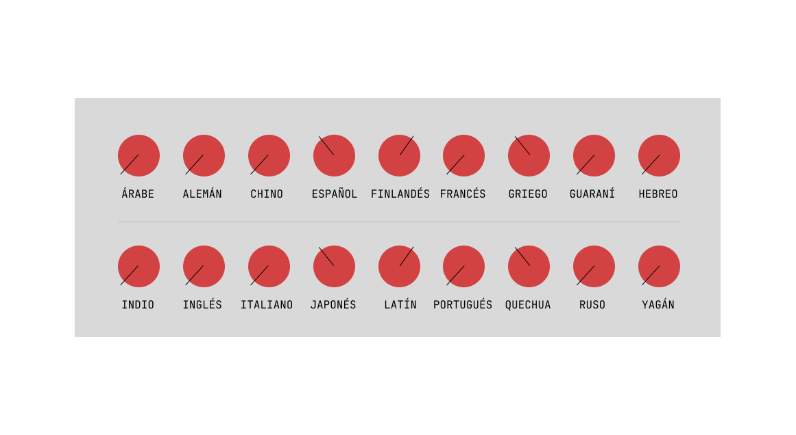

# Apéndice

Esta sección es un anexo donde se encuentran devenires auxiliares de la investigación. Tanto un devenir de obra en formato de carpeta para aplicación a premios, y luego información técnica extra en detalle. Dado que gran parte de este trabajo fue una travesía tecnológica, me parecía pertinente que quede completamente documentada. Sin embargo, como no hace al relato principal, preferí anexar este contenido al final para quien le sea de utilidad o interés.

## gla 1.0b (Generador de Lenguaje Asémico) -MediaLab CCEBA-

En junio de 2023 el [Centro Cultural de España en Buenos Aires (CCEBA)](https://www.cceba.org.ar) lanza la tercera convocatoria [**Apoyo a la producción. Arte Contemporáneo MediaLab CCEBA 2023: Prácticas artísticas y tecnológicas**](https://www.cceba.org.ar/medialab/apoyo-a-la-produccion-2023). Me pareció que mi trabajo podía enmarcarse en la convocatoria y la experiencia de armar un proyecto acotado en alcance y recursos como devenir concreto de la investigación me pareció un buen ejercicio. Además, sería un buen incentivo moral y económico si llegaba a ser seleccionado.

Ideé una pieza llamada `gla 1.0b (generador de lenguaje asémico)` basado en esta investigación. A continuación, la descripción breve que presenté acerca del proyecto:

> El proyecto consiste en una instalación interactiva que invita a escuchar los idiomas del mundo, apelar a nuestro imaginario para lograr entender algo que en principio no hará sentido, pero interpelará nuestras subjetividades. Quienes experimenten la obra se encontrarán con un dispositivo pequeño en un pedestal con un dos auriculares colgados al frente. El aparato es un controlador con perillas rotuladas que representan cada una un idioma distinto. Al interactuar con el sistema se escucharán monólogos teniendo la posibilidad de mezclar cada lengua, descubriendo qué aparece en su interpolación.


<div class="grid">
  <div>
    
    <p class="caption center mt-1">Render de frente de gla 1.0b</p>
  </div>
  <div>
    
    <p class="caption center mt-1">Boceto de interfaz de gla 1.0b</p>
  </div>
</div>

El proyecto [recibió una mención](https://www.cceba.org.ar/medialab/proyectos-seleccionados-y-menciones-2). Se comunicaron para incentivarme a continuarlo, enriquecerlo y participar de futuras instancias de la convocatoria, incluso en otras como el programa [Presente Continuo](https://presentecontinuo.org/).

El proyecto completo que presenté puede encontrarse en este [PDF](_media/230702_Formato-de-proyecto-MediaLab-apoyo-2023.pdf).

## 2ASMRSynth

Pablo desarrolló y probó este instrumento en una distribución de Linux basada en Debian. Yo, en cambio, intenté compilar el software en distintas plataformas. Primero en mi computadora de buenos recursos que corre Windows, me parecía que también aportaría al mundo open source si luego podía compartir mi camino haciéndolo andar en una nueva plataforma. Allí me encontré con problemas propios de arquitecturas y matemáticas de bajo nivel que se escapan del alcance de esta investigación, por lo que abandoné ese camino. Continué con WSL (una forma de ejecutar Linux dentro de Windows), pero las capacidades de ruteo interno MIDI que necesito no están desarrolladas al momento de este trabajo, por lo que también tuve que dejar este camino. Luego probé Raspbian (Debian) en Raspberry Pi, pensando que sería útil esta plataforma para montajes compactos, simples y económicos en cuanto a recursos, pero la arquitectura ARM de los procesadores de RPi no están muy bien soportados en JUCE en este momento, y el procesador y la memoria RAM no son óptimos para este trabajo; otro camino trunco.

Finalmente instalé una máquina virtual en mi computadora con Windows, probé varios softwares de virtualización, primero VirtualBox por ser open source, pero que no utiliza los recursos de la máquina de forma óptima y por ende corría lento. Luego VMWare, que corre mejor, a la que le instalé Linux Mint, y todo funcionó de maravilla. El archivo de audio y video de esta investigación está grabado con ese entorno virtual.

El sintetizador de Pablo Riera es una excelente idea y herramienta para lograr inferencia en tiempo real de un modelo sonoro, pero no estaba alcanzando los resultados que quería, por lo que investigué alternativas en otros entornos donde tuviera más control de las partes involucradas, sin tiempos de compilación ni plataformas específicas, procesamiento y código en tiempo real: entra Miller Puckette. Busqué *cajitas* desarrolladas en [Max/MSP](https://cycling74.com/products/max) o [Pure Data](https://puredata.info/).


Volví a encontrarme con [RAVE](https://forum.ircam.fr/collections/detail/rave/), un *framework* para generar modelos de redes neuronales para audio. Mencioné que *volví* a encontrarlo porque ya lo había investigado como una alternativa al Autoencoder de Riera. El equipo de investigación de [IRCAM](https://www.ircam.fr/) ha desarrollado un objeto de Max `nn~` que podría haber sido de utilidad. El problema es que este sólo corre modelos desarrollados con su estructura, que es diferente al autoencoder que yo entrené, y entrenar un modelo con el framework de RAVE es un proceso que excede el tiempo y recursos que dispuse. Por lo que decidí descartar este camino.

## Separación en fonemas

La tarea de separación en fonemas de los archivos de audio con los que contaba podría hacerse de varias maneras. En primer lugar, manualmente. Esto tardaría demasiado tiempo y esfuerzo, además de que quien realice la tarea debería conocer muy en detalle el idioma y su construcción fonética. Siguiendo el modus operandi habitual actual, la primera intuición fue consultarle a ChatGPT acerca del estado de la cuestión frente a este objetivo. Existen múltiples herramientas de software dedicado en materia lingüística. Entre los que fueron sugeridos se encuentran:

1. **Herramientas de Fonética**:
    - **Praat** es un software de fonética ampliamente utilizado que permite realizar diversos análisis fonéticos. Es útil para anotar los límites de los fonemas y extraer información detallada sobre los mismos.
    - **CMU Sphinx (Pocketsphinx)** es un sistema de reconocimiento de voz de código abierto muy utilizado que incluye herramientas de fonética. Permite convertir audio en secuencias de fonemas y cuenta con envoltorios de Python disponibles.
    - **VOSK** es una relativamente nueva herramienta de ASR (Automatic Speech Recognition) conocida por su velocidad y eficiencia. Utiliza modelos de deep learning y está diseñada para aplicaciones modernas de ASR. Una ventaja de Vosk es que sus modelos tienen un tamaño en general pequeño, lo que la hace adecuada para aplicaciones con espacio de almacenamiento limitado. Además, Vosk admite múltiples idiomas y ofrece modelos pre-entrenados para varios de ellos. Es muy valorada por su facilidad de uso y proporciona integraciones con Python, lo que la hace accesible para desarrolladores.
    - **eSpeak** es un sintetizador de voz compacto y de código abierto que se puede utilizar para la fonetización del habla. Proporciona anotaciones fonéticas.
    - **Phonetisaurus** es un fonetizador basado en transductores finitos (FST) que puede generar secuencias de fonemas a partir de texto.
2. **Sistemas de Reconocimiento Automático del Habla (ASR)**:

    Automatic Speech Recognition es una tecnología que permite a las computadoras implementar sistemas de procesamiento del lenguaje para convertir el habla humana en texto escrito de manera automática. El proceso implica el análisis de las señales de audio para identificar y transcribir las palabras y frases habladas en un formato legible por máquinas. Para lograr esto, utilizan algoritmos y modelos de lenguaje entrenados previamente con grandes conjuntos de datos de audio y texto transcritos emparejados.

    Los sistemas ASR como Kaldi, Mozilla DeepSpeech y el ASR de Google se pueden utilizar para transcribir audio en fonemas. Estos sistemas son más complejos pero ofrecen transcripciones detalladas a nivel de fonema.

3. **Software de Anotación de Fonemas**:

    Existe software como Audacity, una herramienta gratuita y de código abierto para la edición de audio, que se puede utilizar para anotar manualmente los tiempos de los límites de los fonemas. Este proceso puede ser laborioso, pero brinda un control preciso sobre las anotaciones. Otro encontrado fue Sonic Visualizer, de similares características.

4. **Servicios de Transcripción Fonética**:

    Si no es factible realizar la anotación manual, se puede considerar el uso de servicios de transcripción o contratar lingüistas que puedan transcribir los fonemas.

Elegí **VOSK**, dado que ofrecía una metodología de trabajo más amigable y rápida, de fácil instalación y barato en cuanto a recursos computacionales, mayor documentación y comunidad, más modelos entrenados disponibles para su descarga y uso. Así como una persona debe conocer el idioma para trabajarlo, el software también debe contar con modelos entrenados para realizar tareas analíticas sobre el mismo de manera coherente.

VOSK es una kit de herramientas para el reconocimiento de voces. Tiene una interfaz a través de Python, por lo que hacía muy conveniente el desarrollo de scripts para automatizar el proceso de fonetización de los archivos de audio de larga duración de habla en cada lengua recopilados. Comencé iterando **prompts** –conversando– con ChatGPT para el desarrollo del script en cuestión. Este debería tomar un archivo de audio en cualquier formato como entrada y devolver en una carpeta todos los segmentos de fonemas separados cada uno en un nuevo archivo de audio corto –de la duración del fonema–. Este proceso de iteración de desarrollo fue relativamente rápido pero a la vez curioso.

La conversación pasó por varias etapas, fue larga pero rápida y eficaz ya que primero necesitaba entender las diferencias entre dichas herramientas y luego ir generando el código del programa. Esta *charla* fue en inglés ya que el mayor caudal de información de entrenamiento para este LLM está en inglés, por ende, las probabilidades de que los resultados sean más precisos aumenta utilizando este idioma. Paso a narrar una versión resumida de esta conversación donde surge el resultado del programa que utilicé finalmente:

1. Pedí que genere el código necesario para realizar mi objetivo:

    <p class="chat A">generate a script that would chop audio into phonemes using a combination of VOSK and ffmpeg. Its input would be an audio file containing speech in any language and it should output multiple audio files in a folder, each containing one phoneme of the initial audio file.</p>

2. En principio comprendió su tarea, pero el script retornaba timestamps –marcas de tiempo– en formato de texto, de manera que habría que hacer el trabajo de separarlos manualmente.

    <p class="chat A">I need the output to be audio files, not text. Also modify the code so that I can pass the input audio_file and model_path as parameters.</p>

    <div class="chat B">
    To segment an audio file into phoneme audio files using Vosk and allow for input parameters, you can modify the code as follows. This code will take the input audio file, Vosk model path, and an output directory as parameters and save phoneme segments as separate audio files:

    ```python
    import os
    import vosk
    import wave
    import shutil
    
    def segment_audio_to_phonemes(audio_path, model_path, output_dir):
        # Initialize the Vosk recognizer with the model
        model = vosk.Model(model_path)
        recognizer = vosk.KaldiRecognizer(model, 16000)
    
        # Open the audio file
        wf = wave.open(audio_path, 'rb')
    
        # Initialize variables
        results = []
        data = wf.readframes(4000)  # Read audio data in chunks
        segment_count = 0
    
        # Create the output directory if it doesn't exist
        os.makedirs(output_dir, exist_ok=True)
    
        while len(data) > 0:
            recognizer.AcceptWaveform(data)
            data = wf.readframes(4000)
    
            if recognizer.FinalResult():
                # Get the final recognition result
                result = recognizer.Result()
                results.append(result)
    
                # Save the phoneme segment as a separate audio file
                phoneme_audio = recognizer.GetWaveform()
                output_path = os.path.join(output_dir, f'segment_{segment_count}.wav')
                with wave.open(output_path, 'wb') as outwf:
                    outwf.setnchannels(1)
                    outwf.setsampwidth(2)
                    outwf.setframerate(16000)
                    outwf.writeframes(phoneme_audio)
    
                segment_count += 1
    
        return results
    
    def main(audio_file, model_path, output_dir):
        phoneme_results = segment_audio_to_phonemes(audio_file, model_path, output_dir)
    
        for i, result in enumerate(phoneme_results):
            print(f"Segment {i + 1}: {result}")
    
    if __name__ == "__main__":
        # Provide the input audio file, Vosk model path, and output directory as command-line arguments
        input_audio_file = "your_audio.wav"  # Replace with your audio file
        vosk_model_path = "path/to/your/model"  # Replace with the path to the Vosk model
        output_directory = "output_phoneme_segments"  # Replace with your desired output directory
    
        # Clear the output directory if it already exists
        if os.path.exists(output_directory):
            shutil.rmtree(output_directory)
    
        main(input_audio_file, vosk_model_path, output_directory)
    
    ```

    Make sure to provide the appropriate values for `input_audio_file`, `vosk_model_path`, and `output_directory` when running the script. The script will create separate audio files for each phoneme segment in the specified output directory.
    </div>

3. No era exactamente lo que necesitaba, y el código daba errores de funciones inexistentes, como si hubiera inventado partes de una librería que no existe. Aceptó su error y corrigió el código, acercándose bastante al resultado, pero aún con problemas que le hice saber, incluso dándole la pista del *sample rate* donde yo pensaba que radicaba el problema:

    <div class="chat A">
    two problems I have found:

      - the segment text of all results is always empty.
      - the chopped audio files seem to be in slow motion, I guess it was because of the sample rate being wrong, but maybe there's some other reason since we're now using pydub to automatically detect it.

  can you fix these?

  also add a print for the sample rate to be able to check if it was detected correctly.
    </div>

    <div class="chat B">
    I apologize for the issues. Let's address them and add a print statement to display the detected sample rate. Also, it's possible that the Vosk model used for segmentation may not provide phoneme-level output. You may need to use a different model that provides more granular results. Here's the updated script:

    ```python
    import os
    import vosk
    import wave
    import shutil
    import argparse
    from pydub import AudioSegment
    
    def get_sample_rate(audio_path):
        # Use pydub to load the audio file and obtain its sample rate
        audio = AudioSegment.from_file(audio_path)
        return audio.frame_rate
    
    def segment_audio_to_phonemes(audio_path, model_path, output_dir):
        # Get the sample rate of the input audio file
        sample_rate = get_sample_rate(audio_path)
        print(f"Detected sample rate: {sample_rate}")
    
        # Initialize the Vosk recognizer with the model and the detected sample rate
        model = vosk.Model(model_path)
        recognizer = vosk.KaldiRecognizer(model, sample_rate)
    
        # Open the audio file
        wf = wave.open(audio_path, 'rb')
    
        # Initialize variables
        results = []
        data = wf.readframes(4000)  # Read audio data in chunks
        segment_count = 0
    
        # Create the output directory if it doesn't exist
        os.makedirs(output_dir, exist_ok=True)
    
        phoneme_segments = {}  # Store phoneme boundaries and audio data
        phoneme_start = 0  # Start time of the current phoneme segment in milliseconds
    
        while len(data) > 0:
            recognizer.AcceptWaveform(data)
            data = wf.readframes(4000)
    
            if recognizer.FinalResult():
                # Get the final recognition result, which includes phonemes
                result = recognizer.Result()
                results.append(result)
    
                # Extract the end time of the phoneme from the audio frame position
                phoneme_end = wf.tell() / sample_rate * 1000  # Calculate the end time of the phoneme in milliseconds
                phoneme_duration = phoneme_end - phoneme_start
    
                # Store the phoneme boundaries and audio data
                phoneme_segments[segment_count] = {
                    "start": phoneme_start,
                    "end": phoneme_end,
                    "duration": phoneme_duration,
                }
    
                phoneme_start = phoneme_end
                segment_count += 1
    
        # Save the phoneme segments as separate audio files
        wf = wave.open(audio_path, 'rb')  # Reopen the audio file
        for segment_number, boundaries in phoneme_segments.items():
            start_frame = int(boundaries["start"] / 1000 * sample_rate)
            end_frame = int(boundaries["end"] / 1000 * sample_rate)
    
            # Extract the audio data for the phoneme segment
            wf.setpos(start_frame)
            audio_data = wf.readframes(end_frame - start_frame)
    
            # Save the phoneme segment as an audio file
            output_path = os.path.join(output_dir, f'segment_{segment_number}.wav')
            with wave.open(output_path, 'wb') as outwf:
                outwf.setnchannels(1)
                outwf.setsampwidth(2)
                outwf.setframerate(sample_rate)
                outwf.writeframes(audio_data)
    
        return results
    
    def main(args):
        phoneme_results = segment_audio_to_phonemes(args.input_audio_file, args.vosk_model_path, args.output_directory)
    
        for i, result in enumerate(phoneme_results):
            print(f"Segment {i + 1}: {result}")
    
    if __name__ == "__main__":
        parser = argparse.ArgumentParser(description="Segment audio into phoneme audio files using Vosk.")
        parser.add_argument("input_audio_file", type=str, help="Path to the input audio file.")
        parser.add_argument("vosk_model_path", type=str, help="Path to the Vosk model.")
        parser.add_argument("output_directory", type=str, help="Directory to save phoneme audio segments.")
    
        args = parser.parse_args()
        main(args)
    
    ```

    This updated script should display the detected sample rate, and it retains the functionality to segment the audio into phonemes and save them as audio files. If you encounter issues with the phoneme segment text being empty, you may need to investigate whether the chosen Vosk model provides phoneme-level recognition results.
    </div>

4. Supuestamente debía generarme, además de los segmentos de audio, texto de los fonemas separados, pero esto nunca lo logró, así que descarté ese resultado ya que sólo me interesaban los resultados sonoros para el experimento. El problema fue que tampoco solucionó los resultados de audio que parecían estar en *slow motion.*

    <p class="chat A">As I mentioned, the files that the script outputs seem to be pitched down, or slow motion. I need the output wav files to playback at the same pitch as the input file. It seems like the playback speed is wrong.</p>

    Esta vez no hizo nada más que agregar un comentario en el código. Un código comentado no es computado por el intérprete de Python, es sólo una aclaración para el programador humano:

    `# Save the phoneme segment as an audio file with the same sample rate`

    <p class="chat A">you didn't change any code, just a comment, that doesn't change the result. Please correct yourself.</p>

    Esta vez no cambió **nada**. La respuesta fue exactamente la misma que la anterior.

    <p class="chat A">you are still not addressing the issue</p>

    <div class="chat B" id="script-sugerido">
    I apologize for any confusion. To ensure that the output audio files maintain the same pitch and playback speed as the input audio, you should also copy the input audio's sample width and number of channels when saving the phoneme segments. Here's the corrected code:

    <a id="vosk_phoneme_slicer"></a>

    ```python
    # vosk_phoneme_slicer.py
    
    import os
    import vosk
    import wave
    import shutil
    import argparse
    from pydub import AudioSegment
    
    def get_audio_properties(audio_path):
        # Use pydub to load the audio file and obtain its properties
        audio = AudioSegment.from_file(audio_path)
        return audio.frame_rate, audio.sample_width, audio.channels
    
    def segment_audio_to_phonemes(audio_path, model_path, output_dir):
        # Get the properties of the input audio file
        sample_rate, sample_width, channels = get_audio_properties(audio_path)
        print(f"Detected sample rate: {sample_rate}")
    
        # Initialize the Vosk recognizer with the model and the detected sample rate
        model = vosk.Model(model_path)
        recognizer = vosk.KaldiRecognizer(model, sample_rate)
    
        # Open the audio file
        wf = wave.open(audio_path, 'rb')
    
        # Initialize variables
        results = []
        data = wf.readframes(4000)  # Read audio data in chunks
        segment_count = 0
    
        # Create the output directory if it doesn't exist
        os.makedirs(output_dir, exist_ok=True)
    
        phoneme_segments = {}  # Store phoneme boundaries and audio data
        phoneme_start = 0  # Start time of the current phoneme segment in milliseconds
    
        while len(data) > 0:
            recognizer.AcceptWaveform(data)
            data = wf.readframes(4000)
    
            if recognizer.FinalResult():
                # Get the final recognition result, which includes phonemes
                result = recognizer.Result()
                results.append(result)
    
                # Extract the end time of the phoneme from the audio frame position
                phoneme_end = wf.tell() / sample_rate * 1000  # Calculate the end time of the phoneme in milliseconds
                phoneme_duration = phoneme_end - phoneme_start
    
                # Store the phoneme boundaries and audio data
                phoneme_segments[segment_count] = {
                    "start": phoneme_start,
                    "end": phoneme_end,
                    "duration": phoneme_duration,
                }
    
                phoneme_start = phoneme_end
                segment_count += 1
    
        # Save the phoneme segments as separate audio files
        wf = wave.open(audio_path, 'rb')  # Reopen the audio file
        for segment_number, boundaries in phoneme_segments.items():
            start_frame = int(boundaries["start"] / 1000 * sample_rate)
            end_frame = int(boundaries["end"] / 1000 * sample_rate)
    
            # Extract the audio data for the phoneme segment
            wf.setpos(start_frame)
            audio_data = wf.readframes(end_frame - start_frame)
    
            # Save the phoneme segment as an audio file with the same properties as the input audio
            output_path = os.path.join(output_dir, f'segment_{segment_number}.wav')
            with wave.open(output_path, 'wb') as outwf:
                outwf.setnchannels(channels)
                outwf.setsampwidth(sample_width)
                outwf.setframerate(sample_rate)
                outwf.writeframes(audio_data)
    
        return results
    
    def main(args):
        phoneme_results = segment_audio_to_phonemes(args.input_audio_file, args.vosk_model_path, args.output_directory)
    
        for i, result in enumerate(phoneme_results):
            print(f"Segment {i + 1}: {result}")
    
    if __name__ == "__main__":
        parser = argparse.ArgumentParser(description="Segment audio into phoneme audio files using Vosk.")
        parser.add_argument("input_audio_file", type=str, help="Path to the input audio file.")
        parser.add_argument("vosk_model_path", type=str, help="Path to the Vosk model.")
        parser.add_argument("output_directory", type=str, help="Directory to save phoneme audio segments.")
    
        args = parser.parse_args()
        main(args)
    
    ```

    This corrected code ensures that the output audio files maintain the same sample width and number of channels as the input audio, preserving the pitch and playback speed. Please try running this updated code, and let me know if it resolves the issue.
    </div>

En resumen, la conversación con ChatGPT para generar el código, como si fuera un empleado *ad-honorem* de la investigación, pasó por varias etapas. En principio, al no lograr el objetivo requerido, se fue corrigiendo el pedido para alinearlo con este. Luego, la aparición de errores propios del código, como métodos –funciones– que no existen o se llaman de otra forma, y por último un problema sobre los audios generados que no eran generados con el sample rate correcto.

Finalmente, corrí el último [script sugerido](#script-sugerido) sobre uno de los audios de mi dataset para realizar la separación de los archivos de audio. VOSK necesita el archivo del modelo específico para comprender el idioma con el que va a trabajar, por suerte cuentan con varios idiomas ya entrenados y [disponibles](https://alphacephei.com/vosk/models) para su descarga y uso. A continuación algunos de los resultados:

- El audio original a recortar fue de la [conversación en francés](#podcast-frances) descargada de YouTube referido anteriormente.
  Algunos recortes:

<div class="grid">
  <div class="full-width center">
    <audio class="full-width" controls src="_media/segment_0.wav" title="segment_0.wav"></audio>
  </div>
  <div class="full-width center">
    <audio class="full-width" controls src="_media/segment_1.wav" title="segment_1.wav"></audio>
  </div>
  <div class="full-width center">
    <audio class="full-width" controls src="_media/segment_2.wav" title="segment_2.wav"></audio>
  </div>
  <div class="full-width center">
    <audio class="full-width" controls src="_media/segment_3.wav" title="segment_3.wav"></audio>
  </div>
</div>

Al analizar los resultados, los segmentos de fonemas tienen la misma corta duración, lo cual me dio sospechas, sin embargo parecen ser unidades básicas de la lengua en cuestión. Imaginé de inmediato que debía conseguir el modelo para todos los idiomas que quisiera integrar en mi sistema, y si no estaban disponibles habría que generarlos mediante entrenamiento. Comencé a pensar en otras alternativas para realizar esta separación de forma más homogénea en los idiomas, dado que además, no los conozco a todos como para juzgar si los resultados generados serían correctos.

## Script para Experimento #31

Este script se utilizó para recortar todos los audios de una carpeta que luego se importan en AudioStellar para la generación del mapa. En este caso se utilizan las características formales del audio para entender los comienzos y finales de los fragmentos. La librería que nos facilita el trabajo de esta forma es `librosa`, que es también la que usa AudioStellar para realizar esta operación.

Los parámetros se pueden configurar al final del script. Para obtener valores tentativos de cada uno utilicé la función de recortar audio en ASt y al mover los valores se puede previsualizar cómo serían los recortes en la interfaz, es decir, la sensibilidad de detección de transientes y demás que luego determinan en qué partes se fragmenta el audio.

`slicer_onset.py`

```python

# SEPARATE AUDIOS INTO SEGMENTS FOR EACH LANGUAGE FILE.
# TFG AAEE jaunmatrin

# REQUIRES LIBROSA 0.9.1 NOT HIGHER

import os
import librosa
import numpy as np
import scipy.io.wavfile
import os

dir = "./ElevenLabs-JM-test"

supportedFileTypes = ["wav", "mp3"]


def findOnsetsAndCut(window_max, window_avg, delta, backtrack):
    global onset_frames, onset_times, times

    hop_length = 512
    o_env = librosa.onset.onset_strength(y=segmento, sr=sr)
    times = librosa.times_like(o_env, sr=sr)

    window_max_final = window_max * sr // hop_length
    window_avg_final = window_avg * sr // hop_length

    onset_frames = librosa.onset.onset_detect(
        onset_envelope=o_env,
        sr=sr,
        hop_length=hop_length,
        backtrack=backtrack,
        delta=delta,
        # wait=0,
        pre_avg=window_avg_final,
        post_avg=window_avg_final + 1,
        pre_max=window_max_final,
        post_max=window_max_final + 1,
    )

    onset_times = librosa.frames_to_time(onset_frames, sr)


def loadFile(filename):
    global x, sr, segmento

    target = filename
    if not os.path.isfile(target):
        return
    else:
        x, sr = librosa.load(target, sr=None)

    segmento = x


def fadeNormalizeSave(
    folder,
    fadeSamples=1000,
    normalize=True,
):
    segmentoFade = np.copy(segmento)

    for f in range(1, len(onset_frames)):
        sampleFinish = librosa.core.frames_to_samples(onset_frames[f])

        j = fadeSamples
        for i in np.arange(sampleFinish - fadeSamples, sampleFinish + 1):
            segmentoFade[i] *= j / fadeSamples
            j -= 1

    filePath = os.path.dirname(audioFilePath)
    if not os.path.exists(folder):
        os.mkdir(folder)

    for i in range(len(onset_frames) - 1):
        timeF = librosa.core.frames_to_samples(onset_frames[i])
        timeT = librosa.core.frames_to_samples(onset_frames[i + 1])
        filename, ext = os.path.splitext(audioFile)
        archivoAGuardar = f"{filename}_{i}.wav"
        segmentoAGuardar = segmentoFade[timeF:timeT]

        if normalize:
            segmentoAGuardar = np.array(
                (segmentoAGuardar / np.max(np.abs(segmentoAGuardar)))
            )

        scipy.io.wavfile.write(archivoAGuardar, sr, segmentoAGuardar)


def process_folder(input_folder):
    global audioFilePath, audioFile
    for root, dirs, files in os.walk(input_folder):
        for file in files:
            if os.path.splitext(file)[1][1:].lower() in supportedFileTypes:
                audio_file = os.path.join(root, file)
                audioFile = audio_file
                audioFilePath = audio_file
                process_audio_file(audio_file)


def process_audio_file(audio_file):
    loadFile(audio_file)
    if segmento.size > 0:
        findOnsetsAndCut(window_max, window_avg, delta, backtrack)
        if onset_frames.any():
            folder = os.path.dirname(audio_file)
            print("folder: ", folder)
            folder_name = os.path.basename(folder)
            print("folder_name: ", folder_name)
            # output_folder = os.path.join(folder, folder_name + "_slices")
            output_folder = folder
            print("output_folder: ", output_folder)
            os.makedirs(output_folder, exist_ok=True)
            fadeNormalizeSave(output_folder, fade, normalize)


if __name__ == "__main__":
    print("Onset Detection Slicer")
    input_folder = dir
    window_max = 0.10
    window_avg = 0.05
    delta = 0.10
    backtrack = True
    fade = 1000
    normalize = True

    print("processing folder: ", input_folder)
    process_folder(input_folder)
```
