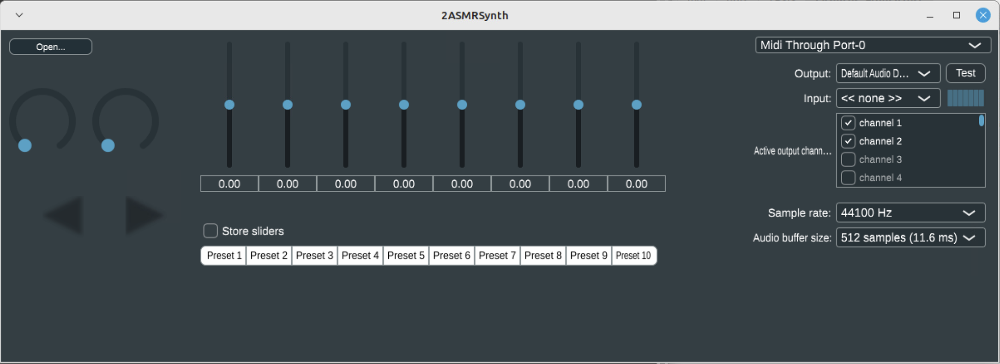

# Experimentos

Para generar un software de habla que no diga nada necesitaba realizar un desarrollo que logre generar sonidos en tiempo real, similar a un instrumento, pero de habla. El puntapié para el comienzo del desarrollo fue la búsqueda de modelos de machine learning que puedan generalizar la voz y devolvernos sonidos, similar a lo que hace un sistema TTS, con la diferencia de que yo no quería darle contenido semántico, y tampoco debía hablar correctamente, es decir, hacer sentido en su dicción. Solamente buscaba que suene como si hablara, pero que no haya palabras reconocibles por dilucidar en lo que se dice.

A lo largo de la investigación y el desarrollo, colaboré principalmente utilizando la versión gratuita de [ChatGPT](https://chat.openai.com/), desarrollado por [OpenAI](https://openai.com/), que en este momento es el modelo gpt-3.5-turbo. Está entrenado con información recopilada de todo internet hasta septiembre de 2021. Comprendí que si se le da contexto y se le define un rol responde de manera muy precisa. Especialmente en tareas pequeñas y específicas, pero también como puntapié inicial hacia las sub-investigaciones que fui llevando a cabo a lo largo del proceso.

Dada la limitación del modelo gratuito de OpenAI, también recurrí a otros LLMs como [Bing Chat](https://www.bing.com/), de [Microsoft](https://www.microsoft.com/), que cuenta con la habilidad de buscar en internet, de hecho, es un buscador similar a [Google](https://www.google.com/), pero con _quien_ uno puede establecer una conversación donde afinar sus resultados. El gigante de internet Google también cuenta con [Bard](https://bard.google.com/chat), pero de momento se encuentra en una etapa experimental, muy revisada por humanos y con poco soporte en idiomas que no sean inglés. Por último probé [LLaVA](https://llava.hliu.cc/): Large Language and Vision Assistant, que si bien promete y es de código abierto, no cuenta con conversaciones que pueda almacenar en hilos de contexto como sí lo hace ChatGPT, teniendo que iniciar nuevas conversaciones en cada sesión de uso.

A continuación relataré los experimentos que realicé en función al objetivo del habla asémica. Si bien dejaré las definiciones técnicas para el final, el relato se verá entrelazado con cuestiones técnicas propias del desarrollo.

## Interpolación de lenguas

Leandro Garber me recomendó que un buen experimento inicial es entrenar un modelo con la arquitectura Autoencoder, en particular uno desarrollado por Pablo Riera. Al ser alimentado con audio de idiomas hablados, tuvimos la hipótesis de que este podría generalizar lo suficiente sus características como para luego generar nuevos resultados sonoros sin necesidad de contenido semántico, quedándose sólo con la prosodia de la lengua.

El desarrollo de Riera no sólo consiste en un modelo que puede ser entrenado con archivos de audio, sino que cuenta además con una especie de sintetizador de inferencia de audio a partir del modelo que se le cargue. Un modelo es en esencia un archivo en la computadora que este software puede cargar y ofrecer en su interfaz una forma de interactuar con su espacio latente: esa abstracción de pocas dimensiones que permite manipular esa generalización de lo que entiende por idioma hablado en forma de sonido.

Para entrenar el modelo necesité un dataset o conjunto de datos preparados o formateados de forma precisa. El primero con el que trabajé fue [common_language](https://huggingface.co/datasets/common_language). Está compuesto por grabaciones de voz de idiomas seleccionados cuidadosamente de la base de datos [Mozilla CommonVoice](https://commonvoice.mozilla.org/). La duración total de las grabaciones de audio es de 45.1 horas (1 hora de material para cada idioma). Está destinado a entrenar sistemas de identificación de idiomas.

A continuación algunos ejemplos de los archivos incluidos en el dataset. Son archivos `.wav`, es decir que no tienen pérdida de calidad:

<audio controls src="_media/common_voice_fr_19598591.wav" title="common_voice_fr_19598591.wav"></audio>
<audio controls src="_media/common_voice_fr_19598240.wav" title="common_voice_fr_19598240.wav"></audio>
<audio controls src="_media/common_voice_fr_19140964.wav" title="common_voice_fr_19140964.wav"></audio>

Nótese que los fragmentos están dichos por diferentes personas, con distintas calidades y condiciones de grabación. Esto se debe a que es necesaria esta variabilidad para enriquecer el modelo, que logre generalizar el habla y la voz humana, pero a ninguna voz en particular.

Para entrenar el Autoencoder debía alimentarlo con un sólo archivo de audio. El dataset cuenta con una carpeta por idioma con pequeños fragmentos, por lo que con el siguiente comando en la terminal de la computadora logré concatenar inmediatamente todos los archivos de una carpeta en un archivo de audio único:

```bash
# Los archivos están nombrados de la siguiente forma:
# common_voice_<lang>_<número>.wav
# Por ejemplo: common_voice_fr_19140964.wav
$ sox common_* frances.wav
# Obtengo `frances.wav` como resultado.
```

`sox` es una utilidad para manipular audio desde la consola, funciona en macOS, Linux y Windows. De esa forma evité el trabajo manual de concatenar todos los archivos.

<audio controls src="_media/french.mp3" title="Archivo de audio mp3 61.8kbps VBR para fines demostrativos, pero se utilizó el wav para entrenar el modelo."></audio>

<p class="caption">Archivo de audio mp3 61.8kbps VBR para fines demostrativos, pero se utilizó el wav para entrenar el modelo.</p>

Lo mismo pero para el Español:

<audio controls src="_media/common_voice_es_18681301.wav" title="common_voice_es_18681301.wav"></audio>
<audio controls src="_media/common_voice_es_19125377.wav" title="common_voice_es_19125377.wav"></audio>
<audio controls src="_media/common_voice_es_19602100.wav" title="common_voice_es_19602100.wav"></audio>

Y su versión concatenada:

<audio controls src="_media/spanish.mp3" title="Archivo convertido a mp3 con ffmpeg a 61.7kbps VBR"></audio>

<p class="caption">Archivo convertido a mp3 con ffmpeg a 61.7kbps VBR</p>

Para entrenar el modelo preparé un Colab con el código a ejecutar y un entorno donde ejecutarlo, que podía ser la nube (Google) o mi computadora. Luego de realizar unos _benchmarks_ -pruebas de rendimiento- observé que mi computadora sería un poco más rápida que los recursos que ofrece el _free tier_ de Google Colab. Así que instalé Anaconda para montar un entorno con la versión requerida de Python y todas las dependencias requeridas para poder ejecutar mi propio Colab, incluso la configuración de seguridad y redes para poder acceder remotamente desde cualquier lado, como si tuviera mi propia nube en mi casa, manteniendo la soberanía de mi sistema computacional.

Realicé el entrenamiento con los archivos de audio concatenados que armé en la etapa del dataset. Esto resultó en modelos _uni-lengua_ ya que sólo podrían generalizar el habla en una sola lengua. Por esto fue que el siguiente paso fue realizar un proceso de entrenamiento con dos lenguas que, como explicaré [más adelante](https://www.notion.so/Un-recorrido-tecno-sonoro-hacia-el-habla-as-mica-31eaddcc2bb841bcaa124ed890ed8ca7?pvs=21), podría generar una cruza interesante. Concatené una conversación en Francés con otra en Japonés como dataset para luego generar un modelo _multi-lengua_ o en este primer caso bilingüe.

Ahora bien, luego de múltiples intentos de que el proceso de entrenamiento funcione, sumado a las horas que este proceso demora, obtuve mi archivo de idioma. ¿Un archivo que representa un idioma? ¿Sería así de simple? ¿En unas horas la computadora sabría lo suficiente para sonar exactamente como suena una persona hablando Francés?

El proceso de entrenamiento que utilicé incluye la posibilidad de obtener el audio de entrada al entrenamiento como un resultado reconstruido por el mismo modelo, de manera que podía rápidamente saber si este al menos podría recrear lo mismo con lo que fue entrenado. Esto es una forma de hacer inferencia.

Dado este audio:

<audio controls src="_media/common_voice_es_19609042.wav" title="Audio original alimentado a la red"></audio>

Se reconstruyó el siguiente audio directamente desde el código. Para eso se insertan en el espacio latente del modelo los mismos valores que devuelve el entrenamiento. Resultando en:

<audio controls src="_media/reconstructed.mp3" title="Audio reconstruido"></audio>


Al solicitarle [inferencia](https://www.notion.so/Un-recorrido-tecno-sonoro-hacia-el-habla-as-mica-31eaddcc2bb841bcaa124ed890ed8ca7?pvs=21) al modelo para generar nuevos sonidos a partir del entrenamiento con los mostrados anteriormente, los resultados no eran muy favorables para mi investigación por su alto nivel de ruido, por lo que decidí buscar videos en YouTube de Podcasts o conversaciones para armar un nuevo dataset. Encontré voces limpias de gente con buena calidad de grabación, sentí que con estos el modelo podría generalizar voces más nítidas.

- Podcast en francés. mp3 55.7kbps VBR para fines demostrativos:

  <audio controls src="_media/french-clean.mp3" title="Audio extraído de https://www.youtube.com/watch?v=N55d9mPm_HA"></audio>

  <p class="caption">Audio extraído de https://www.youtube.com/watch?v=N55d9mPm_HA</p>

- Japonés:
  
  <audio controls src="_media/japanese-clean.mp3" title="Title"></audio>

  <p class="caption">Audio extraído de https://www.youtube.com/watch?v=trySjnuJfJY</p>

### Espacio Latente

La idea es explorar este espacio para encontrar nuevos [_caminos_](https://www.notion.so/Un-recorrido-tecno-sonoro-hacia-el-habla-as-mica-31eaddcc2bb841bcaa124ed890ed8ca7?pvs=21) que extraigan las características principales del sonido con el que fue entrenado el modelo. Con caminos me refiero a datos en serie de tantas dimensiones como tenga el espacio latente –números– que representan esta exploración, y al ser decodificados generan nueva información con las características principales de sus datos de entrada.

En principio, junto con Leandro Garber, pensamos en enviar datos aleatorios de caminos posibles para comenzar a ver qué había en ese espacio latente. Para eso armamos un pequeño patch en Pure Data para enviar los valores en tiempo real al modelo y que este genere audio a partir de los datos de entrada.

El [**2ASMRSynth**](https://github.com/pabloriera/2ASMRS) también programado por Pablo Riera es el sintetizador basado en [JUCE](https://juce.com/) para generar inferencia sonora en tiempo real a partir de un modelo de tipo [torchscript](https://pytorch.org/docs/stable/jit.html). Como expliqué anteriormente, uno carga el modelo en el sintetizador y puede mover los parámetros dentro del espacio latente y escucharlo en tiempo real, como un instrumento. La sonoridad de este instrumento dependerá del modelo cargado.



Cada _fader_ del instrumento representa una de las dimensiones del espacio latente, y al moverlos le estamos asignando valores a cada una. La parte del decodificador del modelo genera la salida de audio. Mover estos valores manualmente, por ejemplo con el mouse, no resulta interesante ya que se debe orquestar un movimiento coordinado de todos los parámetros para que la salida haga _sentido_. Por supuesto que cuenta con la posibilidad de ser controlado mediante el protocolo MIDI.

Con el modelo [multi-lengua](https://www.notion.so/Un-recorrido-tecno-sonoro-hacia-el-habla-as-mica-31eaddcc2bb841bcaa124ed890ed8ca7?pvs=21) la idea fue alimentar las dimensiones del espacio latente con los datos de entrenamiento de un modelo entrenado en Francés anteriormente. La pregunta era ¿qué pasaría si a un modelo bilingüe le hago _hablar_ uno de los idiomas que conoce?

<audio controls src="_media/JF-MODEL_japanese-fantasmagorico.mp3" title="JF-MODEL_japanese-fantasmagorico"></audio>

<p class="caption">JF-MODEL_japanese-fantasmagorico.mp3</p>

Este audio es el resultado de alimentar el modelo bilingüe con los datos de entrenamiento que representan los movimientos dentro del espacio latente para segmento de habla en Francés.

Las siguientes pruebas consisten en cargar los modelos entrenados en el sintetizador _2ASMRSynth_ y luego alimentar los parámetros del modelo (nótese el errático movimiento de los faders) con una lista de cada valor en el tiempo. En el siguiente ejemplo son 8 listas, una para cada dimensión del espacio latente representada en los faders.

<video width="100%" controls src="_media/French8dim.mp4" title="Title"></video>

<p class="caption center">Francés 8 dimensiones</p>

Para lograr esto se desarrolló un patch de Pure Data con el que se cargan los valores numéricos de un archivo de texto (generado durante la etapa de entrenamiento) y se _mapean_ o traducen a controles MIDI (rango de 0-127).

<video width="100%" controls src="_media/French4dim_drunkYlatent.mp4" title="Title"></video>

<p class="caption center">Francés 4 dimensiones recorrido con algoritmo 'drunk'</p>

Esta herramienta que posibilita la ejecución en tiempo real del modelo trae un problema inherente de su método de control: el protocolo MIDI está limitado a valores de 0-127. Esta resolución no es lo suficientemente precisa para _expresar_ la voz en cada una de sus variables internas del espacio latente. Como resultado sonoro aparecen sonidos similares a una voz cuyos movimientos son reminiscentes a algo artificial, quizás medio robótico, con saltos abruptos en su calidad vocal _con_ <em>con</em>sonantes <em>con</em>stantes. La característica fantasmagórica, a su vez, está producida por el problema de la aplicación de una fase aleatoria en el audio. El asunto de la fase es un clásico problema en la generación de audio por IA que explicaré posteriormente en los Conceptos Técnicos.

## Separación en fonemas/fragmentos

Luego de haber aprendido lo suficiente acerca del workflow y las tecnicalidades de la tecnología de inteligencia artificial con la que encaré el proyecto (el modelo Autoencoder de Riera y su sintetizador compañero intérprete), llegué a resultados que no eran exactamente los que esperaba. Por un momento me detuve a contemplar la diferencia entre lo que esperaba y lo que sucedía, ¿fr*acaso acaso*?. Empecé a dudar de si lo que había pensado –crear un sinsentido a partir de un modelo lógico– tenía sentido, pero mi instinto me obligaba a probarlo para poder llegar a esta conclusión.

Inmediatamente, así como fabulé este desarrollo y sus resultados, comencé a hilar un plan B más elemental, uno que quizás tendría que haber sido la primera prueba, pero mi predicción acerca del resultado sonoro era que no iba a ser muy preciso, o escalable, o lo que en mi imaginario buscaba. Esta alternativa consiste en separar grabaciones de habla en fragmentos de unidades básicas que la componen. Un **fonema** es la unidad básica de sonido en un idioma o sistema de comunicación. Representa un sonido distintivo que puede cambiar el significado de una palabra en ese idioma, como sabemos a partir del estudio de la fonología. Pueden variar de un idioma a otro y a menudo se representan con símbolos fonéticos en la lingüística para describir cómo se pronuncian en el habla _(ej. /u/, /s/)_.

Estos recortes vocales, audios segmentados en fonemas, o pequeñas porciones, serían importados en AudioStellar, lo cual brinda dos resultados/piezas que me interesa observar. Por un lado, un mapa de sonidos que quizás estén re-ordenados por sus cualidades sonoras y no por grupos de idiomas, trazando una cartografía diferente en el espacio sonoro que en el geográfico. Además y principalmente, la capacidad de recorrer estos fonemas de las diversas formas que ofrece AudioStellar, haciendo que estos suenen de manera concatenada, por lo que formarían habla.

La distribución de los fonemas en el mapa 2D de AudioStellar es lo que define esta experiencia. He aquí el _trade-off_: una cartografía diferente a la geopolítica de las lenguas versus la interpolación de idiomas al recorrer los bordes entre grupos de fonemas. Paso a explicar:

- Si los fonemas se agrupan geopolíticamente, ie. por idioma, será posible recorrer un idioma específico a través de sus fonemas, sin hacer sentido, pero utilizando contenido -sonidos- propios de un sólo idioma. Esto nos da la ventaja de también poder escuchar qué hay en los bordes de cada grupo de fonemas e interpolar entre idiomas cercanos.
- Si se agrupan por sus características sonoras, se podrán contemplar fonemas similares de los distintos idiomas, se barren las barreras geopolíticas, trazando un mapa donde el sonido hace nuestro sentido (ref sound of nonsense), es nuestra fuente de verdad y no vamos a interpolar entre idiomas sino entre sonidos de diferentes orígenes, agrupados por sus cualidades similares. Así encontramos una nueva [*Cartografía Mundial del Habla*](https://www.notion.so/Un-recorrido-tecno-sonoro-hacia-el-habla-as-mica-31eaddcc2bb841bcaa124ed890ed8ca7?pvs=21).

La entrevista con Mateo Amaral me hizo pensar en el uso no convencional de las herramientas, en este caso tecnologías de generación de habla como los TTS, como un recurso propio de nuestro proceso creativo como artistas trabajando en piezas que luego componen obras. A lo largo del desarrollo de estos experimentos que se describen a continuación, los distintos pasos me hacen pensar en _trucos_ que uso para perseguir mi determinada búsqueda estética.

Al llegar a [TTSmaker.com](http://ttsmaker.com/) y gracias a la charla con Mateo, la idea de no involucrar texto me pareció caduca. Haciendo pruebas con todas las herramientas online que encontré, ideé un flujo que me pareció interesante en cuanto a proceso y sus resultados. Escribir sus instrucciones como _performance informática_ es un nuevo devenir de este proceso que describo a continuación. Invito y celebro su interpretación y modificación.
