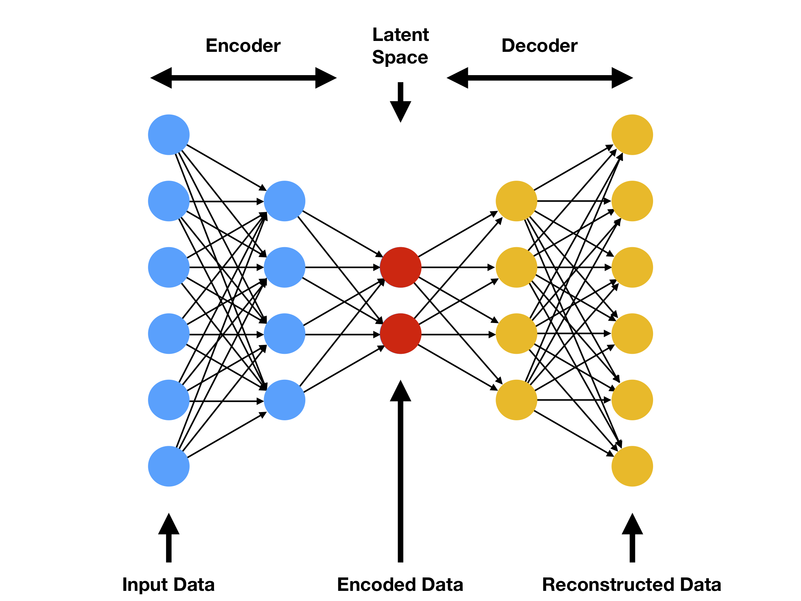

# Conceptos Técnicos

## LLM

Hoy en día contamos con una herramienta que fue fundamental para el avance de la investigación, tanto para realizar preguntas generales guía, búsqueda de referencias, y sobretodo especificidades dentro del desarrollo más duro. Se trata de los modelos grandes de lenguaje, o por sus siglas en inglés, LLMs. Me parece de suma relevancia mencionar esta herramienta dado que este es un desarrollo principalmente práctico cuyo concepto subyacente principal es el lenguaje.

Los modelos de lenguaje basados en transformadores, como los LLMs (Large Language Models), son parte de los **modelos fundacionales** en inteligencia artificial. Estos modelos revolucionaron el procesamiento del lenguaje natural al introducir arquitecturas de transformadores, como el modelo GPT (Generative Pre-trained Transformer). Los LLMs son pre-entrenados en grandes cantidades de datos textuales, lo que les permite una comprensión profunda del lenguaje. Posteriormente, se pueden ajustar para tareas específicas, como traducción, resumen de texto o generación de texto y respuesta a preguntas. Su capacidad para entender y generar lenguaje humano ha impulsado avances significativos en aplicaciones de procesamiento de lenguaje natural, y su adaptabilidad los convierte en componentes clave en una amplia gama de aplicaciones y servicios basados en texto (Vaswani et al., 2023).

## Dataset

Entrenar una red neuronal implica enseñar al modelo a realizar una tarea específica mediante la exposición a datos de entrada y salidas correspondientes. Durante el proceso de entrenamiento, los pesos y las conexiones entre las neuronas de la red se ajustan iterativamente para minimizar la diferencia entre las predicciones del modelo y las respuestas reales en el conjunto de datos. Este ajuste se realiza utilizando algoritmos de optimización que buscan optimizar la función de pérdida, que mide la discrepancia entre las predicciones del modelo y los resultados reales.

Un dataset, o conjunto de datos, es una colección de ejemplos de entrada y sus correspondientes salidas que se utiliza para entrenar, validar o probar un modelo de machine learning. En el contexto de entrenar una red neuronal sirve como la fuente de información que el modelo utiliza para aprender patrones y realizar predicciones. Este conjunto de datos suele dividirse en conjuntos de entrenamiento, validación y prueba. El conjunto de entrenamiento se utiliza para ajustar los parámetros del modelo, el conjunto de validación para afinar hiperparámetros –valores internos del modelo– y evitar el sobreajuste, y finalmente, el conjunto de prueba para evaluar el rendimiento general del modelo en datos no vistos durante el entrenamiento. La calidad y representatividad del dataset son cruciales para el éxito del entrenamiento y el rendimiento del modelo en situaciones del mundo real.

## Autoencoder

Un Autoencoder es una arquitectura de redes neuronales artificiales utilizado en tareas de procesamiento de datos, como la reducción de dimensionalidad y la reconstrucción de información. Se puede pensar como una especie de función que toma datos de entrada, los reduce a una forma más compacta en un espacio de representación interno y luego intenta reconstruir los datos originales a partir de esta representación interna. La idea principal detrás de estos es aprender una representación eficiente de los datos de entrada.

Consiste en las siguientes partes:

1. **Capa de Codificación (Encoder)**: En la primera parte del modelo, llamada el codificador (encoder), los datos de entrada se transforman en una representación interna más compacta. Esta capa reduce la dimensionalidad de los datos, capturando las características más importantes.
2. **Espacio Latente (Latent Space)**: Es la parte del medio, la representación interna o intermedia de los datos que se encuentran entre el codificador y el decodificador. En este espacio latente, las características más importantes de los datos de entrada se capturan de una manera más compacta y abstraída. Es decir, en lugar de describir cada detalle de los datos, el espacio latente representa características más significativas y abstractas. Un espacio latente bien entrenado permite operaciones que permiten explorar y manipular las características subyacentes de los datos de entrada de manera más eficiente.
3. **Capa de Decodificación (Decoder)**: El decodificador (decoder) es la representación interna que se utiliza para intentar reconstruir los datos originales. El objetivo es que la reconstrucción sea lo más fiel posible a las generalidades de los datos de entrada.

Para entrenar el Autoencoder, se utiliza una **función de pérdida** que mide la diferencia entre los datos de entrada y la reconstrucción. El modelo ajusta sus parámetros para minimizar esta pérdida, lo que significa que aprenderá a crear representaciones internas útiles.

El Autoencoder es útil en varias aplicaciones como la eliminación de ruido en datos, la generación de datos similares a los de entrada y la detección de anomalías. Al comprimir la información en una representación interna puede ser útil para simplificar datos complejos y hacer que sea más fácil trabajar con ellos o identificar patrones importantes. Esta reducción de dimensionalidad que simplifica la representación de los datos, en el campo del audio requiere primero realizar la Transformada de Fourier en la que las funciones representativas del sonido pasan del dominio del tiempo al dominio de la frecuencia, obteniendo información acerca de todas las ondas fundamentales en frecuencia y amplitud. Al intentar reconstruir la señal de audio desde el espacio latente, la fase original puede no ser recuperada con precisión, resultando en una señal que carece de la coherencia temporal y espacial adecuada. Esta discrepancia en la fase puede introducir artefactos y distorsiones en el audio generado, afectando negativamente su calidad y naturalidad.

La exploración del espacio latente en un modelo de Autoencoder se asemeja a recorrer un intrincado sistema de [*caminos*](#espacio-latente) en busca de información relevante. Los datos de entrada son como un gran mapa con numerosos senderos, y el Autoencoder actúa como un cartógrafo que reduce la complejidad del mapa, resaltando rutas esenciales en un espacio latente. Al seguir estos caminos, se puede navegar de manera eficiente a través de las características más importantes de los datos, como si fueran flujos de información, permitiendo una comprensión más profunda y la capacidad de generar nuevos datos relacionados a los que entraron.

## Glosario

A continuación, algunas definiciones específicas de las cuestiones técnicas abordadas en este trabajo.

### Asémico

Sin sentido, que no provee contenido dentro del mensaje. Se utiliza especialmente al referirse al uso de canales de comunicación gráficos o sonoros –verbales– que expresan ideas sino que se centran en el aspecto formal del mismo.

### TTS

Sistemas de conversión de texto a habla, por sus siglas en ingles: Text-to-Speech.

### Fine-Tuning

Es el proceso de ajustar un modelo de inteligencia artificial pre-entrenado en un conjunto de datos específico y relacionado para adaptarlo a una tarea específica, generalmente mediante el ajuste de los pesos de las capas del modelo.

### Inferencia

Se refiere al proceso de utilizar un modelo de inteligencia artificial entrenado para realizar predicciones o generar resultados a partir de nuevos datos de entrada, una vez que el modelo ha sido entrenado y ajustado.

### Transientes

Son los sonidos que ocurren brevemente durante una señal de audio, como los clics, los golpes o los ruidos repentinos, que tienen una duración corta en comparación con la señal total.

### OSC

Es un protocolo de comunicación para la transmisión de mensajes de control entre dispositivos y software de audio en tiempo real, utilizado para la comunicación y el control en aplicaciones musicales, de arte sonoro y multimedia. Apareció como una alternativa moderna con mayor flexibilidad y resolución que el protocolo MIDI.

### API

Es un conjunto de reglas y protocolos que permiten que diferentes piezas de software se comuniquen entre sí, facilitando la interacción y el intercambio de datos entre aplicaciones y sistemas informáticos de manera estandarizada y programática.
