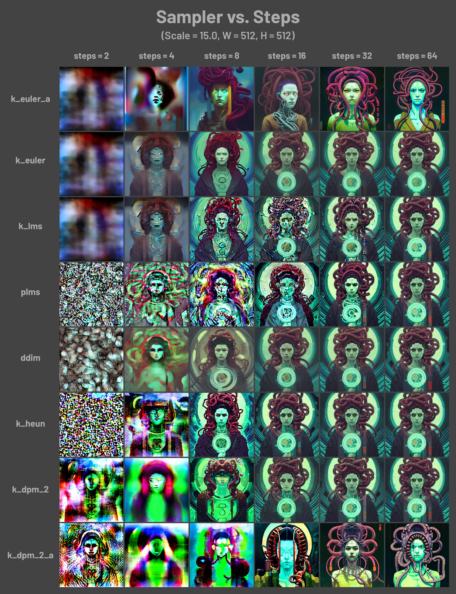

# Entrevistas

Luego de las últimas pruebas y experimentaciones sobre la separación de fonemas, surgió la necesidad de extender la mano hacia colegas que trabajaron con tecnologías aledañas en busca de estrategias alternativas para acercarse al resultado sonoro deseado en el principio de esta investigación.

**ArchiVoz** es un proyecto derivado de [**Intercambios Transorgánicos**](https://intercambiostransorganicos.org/), grupo de investigación radicado en UNTREF dirigido por [**Gala Lucía González Barrios**](https://gala.bio/), del cual fui parte entre 2014 y 2018, y quedé vinculado en forma de consultor externo para necesidades técnicas puntuales. Se puede encontrar más información en el Trabajo Final de Grado de Gala (Barrios & Tedesco, 2021). Ella dio el puntapié inicial para hablar con dos investigadores de su equipo con experiencia en tecnologías basadas en inteligencia artificial para la generación de audio, específicamente, de habla generado por sistemas TTS –texto a habla–.

## ArchiVoz

### Matías Di Bernardo

Matías Di Bernardo es miembro activo de [ArchiVoz](https://intercambiostransorganicos.org/archivoz/) involucrado en el desarrollo técnico con tecnologías de inteligencia artificial para la generación de voces. Específicamente, trabajó en tomar un modelo TTS llamado [Tacotron](https://pytorch.org/hub/nvidia_deeplearningexamples_tacotron2/) y realizar [fine-tuning](#Fine-Tuning) para extrapolar un modelo que originalmente habla inglés, al idioma español. Teniendo en cuenta que existen referencias *performáticas* de personas imitando idiomas eliminando el contenido semántico (ver video en Estado de la Cuestión), una de las ideas fue combinar estos *semi-idiomas* inventados con su par existente para formar un dataset con el que alimentar un modelo. La hipótesis es que esto funcionaría como una suerte de fine-tuning del modelo a la inversa, es decir, que en lugar de ir en dirección a ajustar la precisión de algún acento, idioma, género de esa voz, se busca deformar su semántica, y preservar –o no– el resto de las características.

La cuestión principal que se rescató del encuentro fue que el problema de recorrer un espacio latente de manera aleatoria, o incluso arbitraria, para generar inferencia sobre el modelo y resulte en sonidos similares a la voz era muy baja. Esto se debe a que los modelos de inteligencia artificial funcionan como una caja negra. Encontrar los caminos dentro de una red neuronal que generen las piezas sonoras deseadas es como encontrar una aguja en un pajar. Quizás entrenando el modelo lo suficiente de manera que logre generalizar la voz humana al punto que sin importar qué camino neuronal se tome siempre encontremos semejanza con el habla es una pregunta de investigación dentro del campo de la inteligencia artificial que requiere mucho más tiempo, recursos y trabajo que excede esta instancia. Esto es una motivación para continuar, no para detenerse. Los modelos que logran estos espacios latentes ricos de referencias son masivos. Por ejemplo, DALL-E o Stable Diffusion, en momentos primitivos del proceso de inferencia ya logran dibujar bordes de objetos, es decir, diferenciar figura-fondo.

El desarrollo de un modelo que logre semejante nivel de riqueza en su espacio latente es tarea de grandes equipos y/o empresas que reciben un alto caudal de inversión. Por suerte existen modelos open-source de este calibre que podrían ajustarse a las necesidades de este proyecto, pero para especular estos resultados debemos realizar las pruebas correspondientes, y entrenar para mover estos modelos también es computacionalmente caro si buscamos un cambio radical en sus resultados.

### Sebastían Sosa Welford

Por otro lado, Sebastián Sosa Welford que ya no es parte activa de Intercambios Transorgánicos, al momento de este escrito se desarrolla como asistente de investigadores de CONICET realizando tareas técnicas sobre el trabajo con voces. Sebastián hizo hincapié en que el problema en cuestión no está allanado en el campo de estudio de la generación de voces por computadora ya que lo que la ciencia que impulsa esta tecnología busca resolver otro problema, que en esta época ya está bastante bien logrado. Se trata de generar voces que hablen a la perfección cada idioma, inclusive, muchos idiomas con la misma voz. Un ser artificial políglota, que conoce de emociones y sus entonaciones, acentos de distintas regiones, y hasta puede *encarnar* el género que se le solicite.

Un concepto propuesto por Sosa cuando escuchó la descripción del proyecto es el de la "prosodia macro-dinámica del lenguaje". Este término enmarcado dentro de la lingüística resulta muy apropiado para la descripción de la forma, la cadencia, el ritmo y demás aspectos formales del habla que dejan de lado la semántica.

Una de las tareas de Sebastián en su trabajo fue realizar la anotación de timestamps –marcas de tiempo– que indiquen en qué momento comienza y termina una sílaba. Para ello, utilizó Praat, aquel software especializado en el análisis de habla a través de la fonética desarrollado en la Universidad de Amsterdam, sumado a un script en Python que llama a las funciones de dicha aplicación para realizar las operaciones necesarias para la separación en estas unidades del lenguaje. Este punto en común sumó otro enfoque distinto de cómo realizar una tarea que ya se había realizado anteriormente, aunque la separación fue con fonemas, tanto con otra herramienta para el trabajo con voces –VOSK– como con AudioStellar, que sólo detectaba transientes en el audio como límites de separación.

El joven investigador advirtió que la separación de un audio de lenguaje hablado en unidades más básicas como sílabas o fonemas es una tarea cuasi-subjetiva por el hecho de que depende de cada idioma y de cada hablante. Además, la precisión de dónde comienzan y terminan estas unidades puede ubicarse infinitamente antes o después de los que propone cualquier software de análisis lingüístico, inclusive si esta tarea se realiza manualmente por un actor humano. Dentro de los sistemas TTS, para preparar un modelo debe ser entrenado con un dataset que contenga texto y su componente sonora, en otras palabras, una voz que habla y el texto de lo que dice de manera que la información está emparejada. Una idea que surge en esta conversación es que estas dos versiones de la *misma* información **no** coincidan. Si se entrena un modelo con información "incorrecta" suponemos que vamos a tener un sistema impredecible, que al pedirle que diga algo, dirá otra cosa. Desde luego que es de suma importancia este *des-emparejamiento*, cómo se logre, qué texto corresponderá con qué sonido de habla, tan importante como si se quisiera hacer un TTS funcional en cualquier idioma. Pero también es importante tener en cuenta, a propósito de este proyecto, que la sonoridad de esa voz sería similar a la que le fue dada. ¿Aprenderá siempre igual? ¿Tendrán siempre coincidencias erróneas al ponerlo a prueba? Quizás dependa qué nivel de aprendizaje se alcance, con cuánta precisión pueda representar estas nuevas relaciones entre texto y sonido.

Ambos investigadores habían centrado su trabajo en las tecnologías de text-a-habla –TTS– que habían sido descartadas en un principio por la necesidad de inserción de texto. Esta operación tiene una relación muy directa con el sentido, ya que las voces generadas hablarían lo que se les pida... Entra Mateo Amaral.

## Mateo Amaral

[Mateo Amaral](https://mateoamaral.com/) fue el último convocado en estos encuentros. Es artista visual con énfasis en nuevos medios, colabora con su hermano para el desarrollo técnico de la generación de mundos virtuales generativos, con personajes que hablan en una extraña lengua con similitudes a varias de las que conocemos, sobretodo inglés.

Su principal fuente de sonidos de voces son las tecnologías TTS, utilizadas de forma novedosa. Utilizó servicios como [Uberduck](https://www.uberduck.ai/) y [Musicfy](https://musicfy.lol/). La estrategia fue alimentar estos sistemas con *cualquier cosa*. En lugar de insertar texto legible, reconocible, y en un idioma en particular, lo único respetado fue nuestro teclado occidental como medio a escribir un sinsentido de caracteres para que el sistema los vocalice.

Por otro lado también intentaron entrenar un modelo de Tacotron, pero incluso comprando créditos computacionales en la nube de Google para poder prepararlo rápidamente con mayor poder de cómputo, llegaron lejos de sus resultados esperados. Se sintieron abrumados por la tecnología y la falta de documentación de aquel entonces en esta materia y prefirieron dedicar sus energías a la generación de entornos 3D y personajes autogenerativos, incluyendo sus comportamientos en los escenarios que propone Mateo.

!> Una aclaración importante es que, como se ya se ha visto, los objetivos planteados se basan en predicciones de sus resultados. Estas hipótesis vienen del conocimiento de estas tecnologías y sus posibilidades, pero dada la naturaleza de estos sistemas, sus resultados pueden ser impredecibles. Conocer las internas de un modelo, en esencia matemático, puede ser una tarea insondable para un humano. La predictibilidad de las inferencias generadas por modelos de inteligencia artificial depende de varios factores, como el tipo y tamaño del modelo, la calidad de los datos de entrenamiento y la naturaleza de la tarea en cuestión. En este caso, la generación de audio semejante a una voz –que puede ser de cualquier forma– es de naturaleza muy poco predecible, a diferencia de, por ejemplo, la traducción automática de un texto, que sabiendo el idioma, podemos adelantarnos al resultado.
