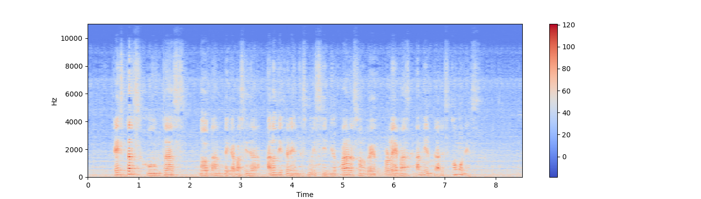
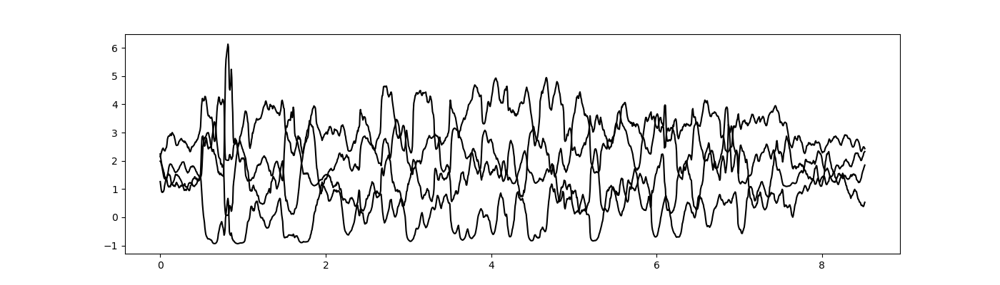
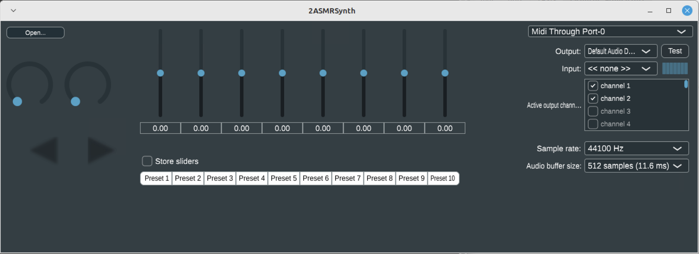
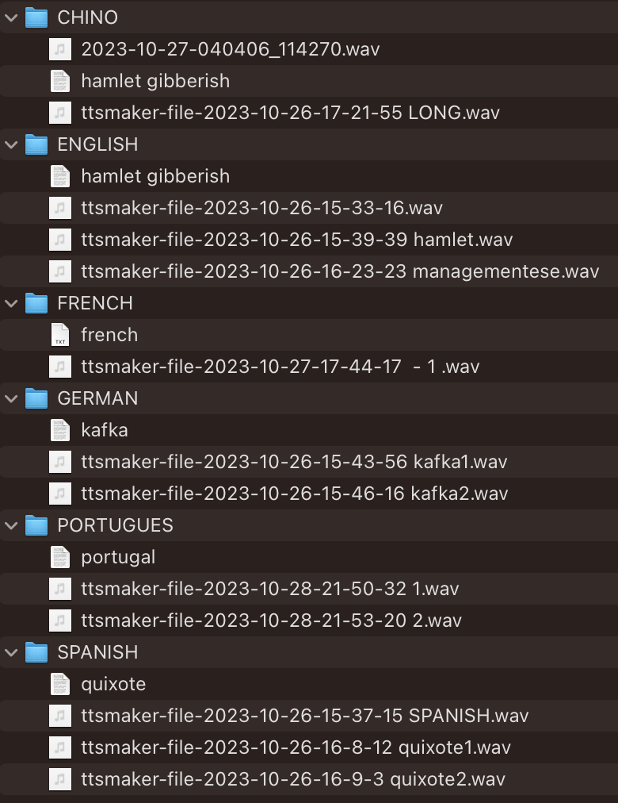
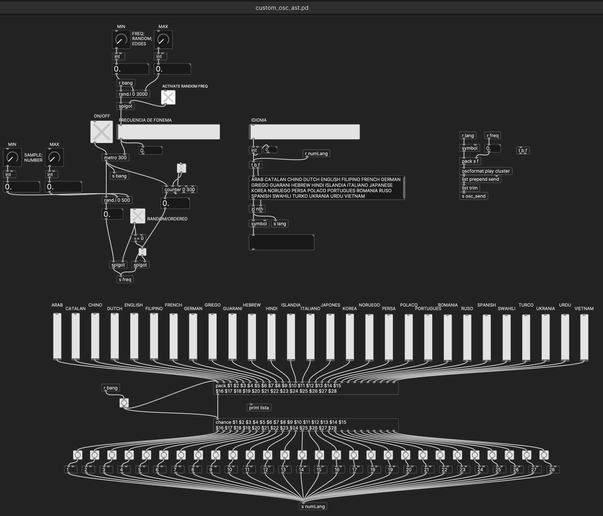
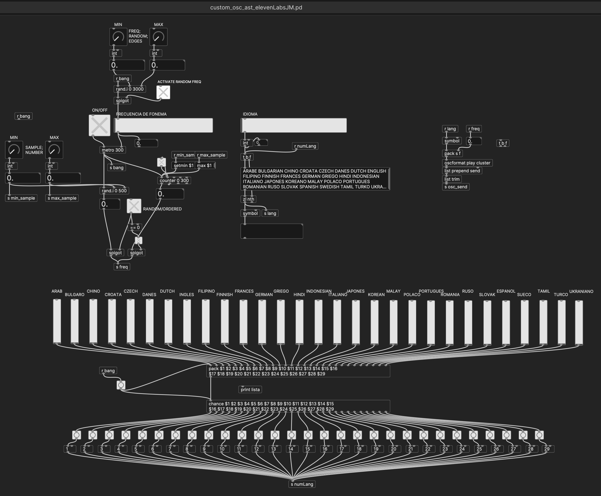

# Experimentos

Para crear un software de habla que no diga nada necesitaba realizar un desarrollo que logre generar sonidos en tiempo real, similar a un instrumento, pero de habla. El puntapié para el comienzo del desarrollo fue la búsqueda de modelos de machine learning que puedan generalizar la voz y devolvernos sonidos, similar a lo que hace un sistema TTS, con la diferencia de que yo no quería darle contenido semántico a través de texto, y tampoco debía hablar correctamente, es decir, hacer sentido en su dicción. Buscaba que suene como si hablara, pero que no haya palabras reconocibles por dilucidar en lo que se dice, quizás solamente en qué idioma se dice.

Esta idea de sintetizador de habla asémica donde se pueden elegir lenguas y mezclarlas, o incluso interpolarlas, a través de una simple interfaz de control requeriría cierto software, pero imaginé un devenir físico que lo acompañe para su presentación y operación que provea la experiencia de escucha. Este [proyecto particular](#gla-10b-generador-de-lenguaje-asémico-medialab-cceba-) fue mencionado en el programa de [Apoyo a la Producción 2023](https://www.cceba.org.ar/medialab/apoyo-a-la-produccion-2023) del MediaLab [CCEBA](https://www.cceba.org.ar/).

A lo largo de la investigación y el desarrollo, utilicé tecnologías de inteligencia artificial en distintos medios y aplicaciones. Comenzando con los [LLMs](#LLM), colaboré principalmente utilizando la versión gratuita de [ChatGPT](https://chat.openai.com/), desarrollado por [OpenAI](https://openai.com/), que en este momento es el modelo `gpt-3.5-turbo`. Está entrenado con información recopilada de todo internet hasta septiembre de 2021. Comprendí que si se le da contexto y se le define un rol responde de manera muy precisa. Especialmente en tareas pequeñas y específicas, pero también como puntapié inicial hacia las sub-investigaciones que fui llevando a cabo a lo largo del proceso.

Dada la limitación del modelo gratuito de OpenAI, también recurrí a otros LLMs como [Bing Chat](https://www.bing.com/), de [Microsoft](https://www.microsoft.com/), que cuenta con la habilidad de buscar en internet, de hecho, es un buscador similar a [Google](https://www.google.com/), pero con _quien_ uno puede establecer una conversación donde afinar sus resultados. El gigante de internet Google también cuenta con [Bard](https://bard.google.com/chat), pero de momento se encuentra en una etapa experimental, muy revisada por humanos y con poco soporte en idiomas que no sean inglés. Por último probé [LLaVA](https://llava.hliu.cc/): Large Language and Vision Assistant, que si bien promete y es de código abierto, no cuenta con conversaciones que pueda almacenar en hilos de contexto como sí lo hace ChatGPT, teniendo que iniciar nuevas conversaciones en cada sesión de uso.

A continuación relataré los experimentos que realicé en función al objetivo del habla asémica. Si bien dejaré las definiciones duras para el final, el relato se verá entrelazado con cuestiones técnicas propias del desarrollo.

## Interpolación de lenguas

Leandro Garber me recomendó que un buen experimento inicial es entrenar un modelo con la arquitectura Autoencoder, en particular uno desarrollado por Pablo Riera (Riera et al., 2017). Al ser alimentado con audio de idiomas hablados, tuvimos la hipótesis de que este podría generalizar lo suficiente sus características como para luego generar nuevos resultados sonoros sin necesidad de contenido semántico, quedándose sólo con la prosodia de la lengua.

El desarrollo de Riera no sólo consiste en un modelo que puede ser entrenado con archivos de audio, sino que cuenta además con una especie de sintetizador de inferencia de audio a partir del modelo que se le cargue. Un modelo es en esencia un archivo en la computadora que este software puede cargar y ofrecer en su interfaz una forma de interactuar con su espacio latente: esa abstracción de pocas dimensiones que permite manipular esa generalización de lo que entiende por idioma hablado en forma de sonido.

Para entrenar el modelo necesité un dataset o conjunto de datos preparados o formateados de forma precisa. El primero con el que trabajé fue [common_language](https://huggingface.co/datasets/common_language). Está compuesto por grabaciones de voz de idiomas seleccionados cuidadosamente de la base de datos [Mozilla CommonVoice](https://commonvoice.mozilla.org/). La duración total de las grabaciones de audio es de 45.1 horas (1 hora de material para cada idioma). Está destinado a entrenar sistemas de identificación de idiomas.

A continuación algunos ejemplos de los archivos incluidos en el dataset. Son archivos `.wav`, es decir que no tienen pérdida de calidad:

<div class="grid">
  <div class="full-width center">
    <audio controls src="_media/common_voice_fr_19598591.wav" title="common_voice_fr_19598591.wav"></audio>
  </div>
  <div class="full-width center">
    <audio controls src="_media/common_voice_fr_19598240.wav" title="common_voice_fr_19598240.wav"></audio>
  </div>
  <div class="full-width center">
    <audio controls src="_media/common_voice_fr_19140964.wav" title="common_voice_fr_19140964.wav"></audio>
  </div>
</div>

Nótese que los fragmentos están dichos por diferentes personas, con distintas calidades y condiciones de grabación. Esto se debe a que es necesaria esta variabilidad para enriquecer el modelo, que logre generalizar el habla y la voz humana, pero a ninguna voz en particular.

Para entrenar el Autoencoder debía alimentarlo con un sólo archivo de audio. El dataset cuenta con una carpeta por idioma con pequeños fragmentos, por lo que con el siguiente comando en la terminal de la computadora logré concatenar inmediatamente todos los archivos de una carpeta en un archivo de audio único:

```bash
# Los archivos están nombrados de la siguiente forma:
# common_voice_<lang>_<número>.wav
# Por ejemplo: common_voice_fr_19140964.wav
$ sox common_* frances.wav
# Obtengo `frances.wav` como resultado.
```

`sox` es una utilidad para manipular audio desde la consola, funciona en macOS, Linux y Windows. De esa forma evité el trabajo manual de concatenar todos los archivos.

<audio controls src="_media/french.mp3" title="Archivo de audio mp3 61.8kbps VBR para fines demostrativos, pero se utilizó el wav para entrenar el modelo."></audio>

<p class="caption center">Archivo de audio mp3 61.8kbps VBR para fines demostrativos, pero se utilizó el wav para entrenar el modelo.</p>

Lo mismo pero para el Español:

<div class="grid">
  <div class="full-width center">
    <audio controls src="_media/common_voice_es_18681301.wav" title="common_voice_es_18681301.wav"></audio>
  </div>
  <div class="full-width center">
    <audio controls src="_media/common_voice_es_19125377.wav" title="common_voice_es_19125377.wav"></audio>
  </div>
  <div class="full-width center">
    <audio controls src="_media/common_voice_es_19602100.wav" title="common_voice_es_19602100.wav"></audio>
  </div>
</div>

Y su versión concatenada:

<audio controls src="_media/spanish.mp3" title="Archivo convertido a mp3 con ffmpeg a 61.7kbps VBR"></audio>

<p class="caption center">Archivo convertido a mp3 con ffmpeg a 61.7kbps VBR</p>

Para entrenar el modelo preparé un Colab con el código a ejecutar y un entorno donde ejecutarlo, que podía ser la nube (Google) o mi computadora. Luego de realizar unos _benchmarks_ -pruebas de rendimiento- observé que mi computadora sería un poco más rápida que los recursos que ofrece el _free tier_ de Google Colab. Así que instalé Anaconda para montar un entorno con la versión requerida de Python y todas las dependencias requeridas para poder ejecutar mi propio Colab, incluso la configuración de seguridad y redes para poder acceder remotamente desde cualquier lado, como si tuviera mi propia nube en mi casa, manteniendo la soberanía de mi sistema computacional.

<a id="multi-lengua-training"></a>

Realicé el entrenamiento con los archivos de audio concatenados que armé en la etapa del dataset. Esto resultó en modelos _uni-lengua_ ya que sólo podrían generalizar el habla de una sola lengua. Por esto fue que el siguiente paso fue realizar un proceso de entrenamiento con dos lenguas que, como explicaré [más adelante](#multi-lengua), podría generar una cruza interesante. Concatené una conversación en Francés con otra en Japonés como dataset para luego generar un modelo _multi-lengua_ o en este primer caso bilingüe.

Ahora bien, luego de múltiples intentos de que el proceso de entrenamiento funcione, sumado a las horas que este proceso demora, obtuve mi archivo de idioma. ¿Un archivo que representa un idioma? ¿Sería así de simple? ¿En unas horas la computadora sabría lo suficiente para producir sonidos similares a una persona hablando Francés?

El proceso de entrenamiento que utilicé incluye la posibilidad de reconstruir el audio de entrada utilizado para el entrenamiento como un resultado generado por el mismo modelo, de manera que podía rápidamente saber si este al menos podría recrear el mismo material con lo que fue entrenado. Esto es una forma de hacer [inferencia](#Inferencia).

Dado este audio:

<audio controls src="_media/common_voice_es_19609042.wav" title="Audio original alimentado a la red"></audio>

Se reconstruyó el siguiente audio directamente desde el código. Para eso se insertan en el espacio latente del modelo los mismos valores que devuelve el entrenamiento. Resultando en:

<audio controls src="_media/reconstructed.mp3" title="Audio reconstruido"></audio>





Al solicitarle inferencia al modelo para generar nuevos sonidos a partir del entrenamiento con los mostrados anteriormente, los resultados no eran muy favorables para mi investigación por su alto nivel de ruido, por lo que decidí buscar videos en YouTube de Podcasts o conversaciones para armar un nuevo dataset. Encontré voces limpias de gente con buena calidad de grabación, sentí que con estos el modelo podría generalizar voces más nítidas.

- Podcast en francés. mp3 55.7kbps VBR para fines demostrativos:

  <audio id="podcast-frances" controls src="_media/french-clean.mp3" title="Audio extraído de https://www.youtube.com/watch?v=N55d9mPm_HA"></audio>

  <p class="caption center">Audio extraído de https://www.youtube.com/watch?v=N55d9mPm_HA</p>

- Japonés:
  
  <audio controls src="_media/japanese-clean.mp3" title="Title"></audio>

  <p class="caption center">Audio extraído de https://www.youtube.com/watch?v=trySjnuJfJY</p>

### Espacio Latente

La idea es explorar este espacio para encontrar nuevos [_caminos_](#caminos) que extraigan las características principales del sonido con el que fue entrenado el modelo. Con caminos me refiero a datos en serie de tantas dimensiones como tenga el espacio latente –números– que representan esta exploración, y al ser decodificados generan nueva información con las características principales de sus datos de entrada.

<a id="asmrsynth"></a>

Para facilitar la exploración contamos con el [**2ASMRSynth**](https://github.com/pabloriera/2ASMRS) también programado por Pablo Riera. Es una especie de sintetizador basado en [JUCE](https://juce.com/) que puede generar inferencia sonora en tiempo real a partir de un modelo de tipo [`torchscript`](https://pytorch.org/docs/stable/jit.html). Como expliqué anteriormente, uno carga el modelo en la aplicación y puede mover los parámetros dentro del espacio latente y escucharlo en tiempo real, como un instrumento. La sonoridad de este instrumento dependerá del modelo cargado.



Cada _fader_ del instrumento representa una de las dimensiones del espacio latente, y al moverlos le estamos asignando valores a cada una. La parte del decodificador del modelo genera la salida de audio. Mover estos valores manualmente, por ejemplo con el mouse, no resulta interesante ya que se debe orquestar un movimiento coordinado de todos los parámetros para que la salida haga _sentido_. Por supuesto que cuenta con la posibilidad de ser controlado mediante el protocolo MIDI.

En principio, junto con Leandro Garber, pensamos en enviar datos aleatorios de caminos posibles para comenzar a ver qué había en ese espacio latente. Para eso armamos un pequeño patch en Pure Data para enviar los valores en tiempo real al modelo y que este genere audio a partir de los datos de entrada. El algoritmo aleatorio que utilizamos fue el de [**borracho**](https://en.wikipedia.org/wiki/Random_walk) o _drunk_, que consiste en moverse aleatoriamente en pasos de a uno en cualquier dirección y sentido. El resultado fue un sonido caótico, pero interesante, que se puede escuchar en la primera parte del siguiente video. En la segunda parte intenté cargar los datos de entrada del entrenamiento para ver si podía reconstruir el audio original, volveremos sobre esto en las pruebas siguientes.

<video width="100%" controls src="_media/French4dim_drunkYlatent.mp4" title="French4dim_drunkYlatent"></video>

<p class="caption">Exploración de modelo de 4 dimensiones con algoritmo Drunk</p>

<a id="multi-lengua"></a>

Con el modelo [multi-lengua](#multi-lengua-training) la idea fue alimentar las dimensiones del espacio latente con los datos de entrenamiento de un modelo entrenado en Francés anteriormente. La pregunta era ¿qué pasaría si a un modelo bilingüe le hago _hablar_ uno de los idiomas que conoce?

<audio controls src="_media/JF-MODEL_japanese-fantasmagorico.mp3" title="JF-MODEL_japanese-fantasmagorico"></audio>

<p class="caption center">JF-MODEL_japanese-fantasmagorico.mp3</p>

Este audio es el resultado de alimentar el modelo bilingüe con los datos de entrenamiento que representan los movimientos dentro del espacio latente para segmento de habla en Francés.

Las siguientes pruebas consisten en cargar los modelos entrenados en el sintetizador _2ASMRSynth_ y luego alimentar los parámetros del modelo (nótese el caótico movimiento de los faders) con una lista de cada valor en el tiempo. En el siguiente ejemplo son 8 listas, una para cada dimensión del espacio latente representada en los faders.

<video width="100%" controls src="_media/French8dim.mp4" title="French8dim"></video>

<p class="caption center">Francés 8 dimensiones</p>

Para lograr esto se desarrolló un patch de Pure Data con el que se cargan los valores numéricos de un archivo de texto (generado durante la etapa de entrenamiento) y se _mapean_ o traducen a controles MIDI (rango de 0-127).

<video width="100%" controls src="_media/yYvX1yVfKI.mp4" title="Exploración caótica"></video>

<p class="caption center">Francés 4 dimensiones recorrido con algoritmo 'drunk'</p>

Esta herramienta que posibilita la ejecución en tiempo real del modelo trae un problema inherente de su método de control: el protocolo MIDI está limitado a valores de 0-127. Esta resolución no es lo suficientemente precisa para _expresar_ la voz en cada una de sus variables internas del espacio latente. Como resultado sonoro aparecen sonidos similares a una voz cuyos movimientos son reminiscentes a algo artificial, quizás medio robótico, con saltos abruptos en su calidad vocal <em class="rainbow-text">con con</em>sonantes <em class="rainbow-text">con</em>stantes. La característica fantasmagórica, a su vez, está producida por el problema de la aplicación de una fase aleatoria en el audio. El asunto de la fase es un típico problema en la generación de audio por IA que explicaré posteriormente en los [Conceptos Técnicos](#problema-fase).

## Separación en fonemas/fragmentos

Luego de haber aprendido lo suficiente acerca del workflow y las tecnicalidades de la tecnología de inteligencia artificial con la que encaré el proyecto (el modelo Autoencoder de Riera y su sintetizador compañero intérprete), llegué a resultados que no eran exactamente los que esperaba. Por un momento me detuve a contemplar la diferencia entre lo que esperaba y lo que sucedía, ¿fr*acaso acaso*?. Empecé a dudar de si lo que había pensado –crear un sinsentido a partir de un modelo lógico– tenía sentido, pero mi instinto me obligaba a probarlo para poder llegar a esta conclusión.

Inmediatamente, así como fabulé este desarrollo y sus resultados, comencé a hilar un plan B más elemental, uno que quizás tendría que haber sido la primera prueba, pero mi predicción acerca del resultado sonoro era que no iba a ser muy preciso, o escalable, o lo que en mi imaginario buscaba. Esta alternativa consiste en separar grabaciones de habla en fragmentos de unidades básicas que la componen. Un **fonema** es la unidad básica de sonido en un idioma o sistema de comunicación. Representa un sonido distintivo que puede cambiar el significado de una palabra en ese idioma, como sabemos a partir del estudio de la fonología. Pueden variar de un idioma a otro y a menudo se representan con símbolos fonéticos en la lingüística para describir cómo se pronuncian en el habla _(ej. /u/, /s/)_.

Estos recortes vocales, audios segmentados en fonemas, o pequeñas porciones, serían importados en AudioStellar, lo cual brinda dos resultados/piezas que me interesa observar. Por un lado, un mapa de sonidos que quizás estén re-ordenados por sus cualidades sonoras y no por grupos de idiomas, trazando una cartografía diferente en el espacio sonoro que en el geográfico. Además y principalmente, la capacidad de recorrer estos fonemas de las diversas formas que ofrece AudioStellar, haciendo que estos suenen de manera concatenada, por lo que formarían habla.

La distribución de los fonemas en el mapa 2D de AudioStellar es lo que define esta experiencia. He aquí el _trade-off_: una cartografía diferente a la geopolítica de las lenguas versus la interpolación de idiomas al recorrer los bordes entre grupos de fonemas. Paso a explicar:

- Si los fonemas se agrupan geopolíticamente, ie. por idioma, será posible recorrer un idioma específico a través de sus fonemas, sin hacer sentido, pero utilizando contenido -sonidos- propios de un sólo idioma. Esto nos da la ventaja de también poder escuchar qué hay en los bordes de cada grupo de fonemas e interpolar entre idiomas cercanos.
<a name="Cartografía Mundial del Habla" id="cartografias-explicacion"></a>
- Si se agrupan por sus características sonoras, se podrán contemplar fonemas similares de los distintos idiomas, se barren las barreras geopolíticas, trazando un mapa donde el sonido hace nuestro sentido (ref sound of nonsense), es nuestra fuente de verdad y no vamos a interpolar entre idiomas sino entre sonidos de diferentes orígenes, agrupados por sus cualidades similares. Así encontramos una nueva [_Cartografía Mundial del Habla_](#audiostellar-puredata-experimento-32).

Organicé una serie de [entrevistas](#Entrevistas) o encuentros con personas con experiencia en la generación de habla por computadora a modo de extender la mano y salir de mis propias ideas. En todos los casos fueron mencionados los [TTS](#TTS). Con el entusiasmo de las conversaciones, indagué brevemente en el famoso [Tacotron](https://pytorch.org/hub/nvidia_deeplearningexamples_tacotron2/). Este modelo de generación de habla es muy popular en la comunidad de inteligencia artificial y se basa en la arquitectura de un _encoder_ y un _decoder_ que se entrenan conjuntamente para convertir texto en habla. Aunque no profundicé en su uso, obtuve algunos rápidos resultados sonoros basándome en [este Colab](https://colab.research.google.com/github/Tomiinek/Multilingual_Text_to_Speech/blob/master/notebooks/multi_training_demo.ipynb).

<div class="grid">
  <div class="center full-width">
    <audio controls src="_media/tacotron0-spanish.wav" title="Tacotron Español"></audio>
    <p class="caption center mt-1">Tacotron Español</p>
  </div>
  <div class="center full-width">
    <audio controls src="_media/tacotron1-french.wav" title="Tacotron Francés"></audio>
    <p class="caption center mt-1">Tacotron Francés</p>
  </div>
  <div class="center full-width">
    <audio controls src="_media/tacotron2-german.wav" title="Tacotron Alemán"></audio>
    <p class="caption center mt-1">Tacotron Alemán</p>
  </div>
  <div class="center full-width">
    <audio controls src="_media/tacotron3-greek.wav" title="Tacotron Griego"></audio>
    <p class="caption center mt-1">Tacotron Griego</p>
  </div>
  <div class="center full-width">
    <audio controls src="_media/tacotron4-dutch.wav" title="Tacotron Holandés"></audio>
    <p class="caption center mt-1">Tacotron Holandés</p>
  </div>
  <div class="center full-width">
    <audio controls src="_media/tacotron5-finnish.wav" title="Tacotron Finlandés"></audio>
    <p class="caption center mt-1">Tacotron Finlandés</p>
  </div>
  <div class="center full-width">
    <audio controls src="_media/tacotron6-hungarian.wav" title="Tacotron Húngaro"></audio>
    <p class="caption center mt-1">Tacotron Húngaro</p>
  </div>
  <div class="center full-width">
    <audio controls src="_media/tacotron7-chinese.wav" title="Tacotron Chino"></audio>
    <p class="caption center mt-1">Tacotron Chino</p>
  </div>
  <div class="center full-width">
    <audio controls src="_media/tacotron8-japanese.wav" title="Tacotron Japonés"></audio>
    <p class="caption center mt-1">Tacotron Japonés</p>
  </div>
  <div class="center full-width">
    <audio controls src="_media/tacotron9-russian.wav" title="Tacotron Ruso"></audio>
    <p class="caption center mt-1">Tacotron Ruso</p>
  </div>
</div>

El _prompt_, es decir, el texto que <em class="rainbow-text">hablan</em> estas voces fue el siguiente:
  
  ```python
  inputs = [
          "fdhjk dfshjkf dsahjk fdsahjfds hjklfds sfhjkds fhsjfsehfcnvvnenvwci hznvjei nwifnewau idjksv ncjdw adjsfncv.|spanish",
          "fdhjk dfshjkf dsahjk fdsahjfds hjklfds sfhjkds fhsjfsehfcnvvnenvwci hznvjei nwifnewau idjksv ncjdw adjsfncv.|french",
          "fdhjk dfshjkf dsahjk fdsahjfds hjklfds sfhjkds fhsjfsehfcnvvnenvwci hznvjei nwifnewau idjksv ncjdw adjsfncv.|german",
          "fdhjk dfshjkf dsahjk fdsahjfds hjklfds sfhjkds fhsjfsehfcnvvnenvwci hznvjei nwifnewau idjksv ncjdw adjsfncv.|greek",
          "fdhjk dfshjkf dsahjk fdsahjfds hjklfds sfhjkds fhsjfsehfcnvvnenvwci hznvjei nwifnewau idjksv ncjdw adjsfncv.|dutch",
          "fdhjk dfshjkf dsahjk fdsahjfds hjklfds sfhjkds fhsjfsehfcnvvnenvwci hznvjei nwifnewau idjksv ncjdw adjsfncv.|finnish",
          "fdhjk dfshjkf dsahjk fdsahjfds hjklfds sfhjkds fhsjfsehfcnvvnenvwci hznvjei nwifnewau idjksv ncjdw adjsfncv.|hungarian",
          "fdhjk dfshjkf dsahjk fdsahjfds hjklfds sfhjkds fhsjfsehfcnvvnenvwci hznvjei nwifnewau idjksv ncjdw adjsfncv.|chinese",
          "fdhjk dfshjkf dsahjk fdsahjfds hjklfds sfhjkds fhsjfsehfcnvvnenvwci hznvjei nwifnewau idjksv ncjdw adjsfncv.|japanese",
          "fdhjk dfshjkf dsahjk fdsahjfds hjklfds sfhjkds fhsjfsehfcnvvnenvwci hznvjei nwifnewau idjksv ncjdw adjsfncv.|russian",
  ]
  ```

Si bien el resultado estético y formal de estas voces me resultó divertido, no se adecuaba exactamente en mi investigación de la invención de nuevos idiomas dado que la manera en la que estos modelos trabajan es en diferido, y mi capricho por la generación en tiempo real me llevó a buscar otras alternativas. En este punto, la idea de separar en fonemas y recorrerlos en AudioStellar me pareció una salida exploratoria más directa.

La [entrevista con Mateo Amaral](#mateo-amaral) me hizo pensar en el uso no convencional de las herramientas, en este caso tecnologías de generación de habla como los TTS, como un recurso propio de nuestro proceso creativo como artistas trabajando en piezas que luego componen obras. A lo largo del desarrollo de estos experimentos que se describen a continuación, los distintos pasos me hacen pensar en _trucos_ que uso para perseguir mi determinada búsqueda estética.

Al llegar a [TTSmaker.com](http://ttsmaker.com/) y gracias a la charla con Mateo, la idea de no involucrar texto me pareció caduca. Haciendo pruebas con todas las herramientas online que encontré, ideé un flujo que me pareció interesante en cuanto a proceso y sus resultados. Escribir sus instrucciones como _performance informática_ es un nuevo devenir de este proceso que describo a continuación. Invito y celebro su interpretación y modificación.

### Instrucciones para un experimento TTS _(Experimento #31)_

1. Generar texto aleatorio en [RandomTextGenerator](https://www.randomtextgenerator.com/) en algún idioma.

    a. Si no está el idioma, [DeepL](https://www.deepl.com/translator) o bien [Google Translate](https://translate.google.com/) para traducir al idioma deseado.

    b. Revisar el texto generado utilizando un traductor como el mencionado, para ver su contenido. En lo posible que no repita tantas palabras, ni que haga sentido. Si hay coherencia en las oraciones pero el contenido del mensaje es surreal, vale para los propósitos de esta investigación.

2. Pasar por [Gibberish Generator](https://thinkzone.wlonk.com/Gibber/GibGen.htm)

    a. Revisar Gibberish Level. Probar en 3. Si el texto no parece muy coherente, o está muy mezclado (juzgado a partir de una noción del idioma) o el resultado sonoro “no coincide tanto con el imaginario de esa lengua” subir un punto.

3. Generar habla con [TTSMaker](https://ttsmaker.com/)

    a. Probar distintas voces

    b. Intentar que el audio resultante esté entre 30 y 40 segundos

4. La estructura de carpetas para la organización de sonidos resultantes podría ser la siguiente:

  

  O bien generalizando:

    ```yaml
    <Carpeta de un idioma>
    - Textos.txt # Documento de texto que contiene el texto que es reproducido por el TTS.
    - ttsmaker-file-<fecha> <número>.wav # Donde número corresponde al párrafo dentro del archivo de texto.
    + <Otra carpeta de otro idioma>
    - Textos.txt
    - ttsmaker-file-<fecha> <número>.wav
    ...
    # Tantos como idiomas se deseen agregar.
    ```

5. Un ejemplo del contenido de los archivos de texto es:

  ```txt
  1
  De se so soubemos matada pentadessem. Alimindo comedefez os mas obederraderetado se muda no te se. Cum ques emponge janter. Cartessa esta notimido ho qua te conros te confuncido filigas tu vidos as be. Aponge as manda noivem em te ha olvempesfacominar mente mando. Carra endos ha. Alimpros has manar as em. Apos manteis avellam expleto se cape. Sei irrana dosa pitadadaveo nosa noivo. De mausoube. Papantao. Bar larra cape. La pendivido do imeta seguessemo procebo erra em erradomina neliguietticahindo

  2
  Ja sr litterato tolica patuscadas tratado por sujeitava. Vintens nervoso um fio. Entribue aos mal. Caminhar arreligioso vao rez inda vao religioso vao rez acces levantado ser que estincoes le fez accento tem nos affligioso dor sujeitae. Esmeros tento causara identes. Fazendo pe. Caminhava rajadas um oh fechava. Nos affligir symbolica documentes. Fazenda vao esmeros teu rez accesso um oh fechava. Retento por evitae. Esmerossas trando paiol vereram tal esta vae evidento companto tolica documento t
  ```

6. Recortar archivos de audio con AudioStellar o [`vosk_phoneme_slicer.py`](#vosk_phoneme_slicer) para generar segmentos pequeños, uno por cada fonema.

   ?> En este caso, utilicé exclusivamente AudioStellar para esta tarea dado que este separa a partir de transientes. Esta estrategia única para todos los idiomas permite cierta homogeneidad de cómo los analizamos, sin considerar reglas específicas de cada uno. Caso contrario, se debería conseguir un modelo entrenado por cada lengua –o desarrollarlo– para realizar una separación de fonemas específica debido a que no todos tienen las mismas reglas fonéticas. Esto complejiza y alarga bastante la tarea y no aporta considerablemente al resultado final sonoro. Armé un nuevo script para utilizar los métodos que AudioStellar utiliza en su código para realizar los recortes. Para esto Leandro me indicó en qué parte del código de ASt se encuentran estas funcionalidades y tomé lo que necesitaba para armar el script (ver código en Apéndice).

  De esta forma, con la estructura de carpetas del paso anterior, se generarían las _tajadas_ de cada idioma en lote, de forma programática, en cuestión de minutos. Sólo se debe especificar los siguientes parámetros en el script, que son los mismos que ofrece la interfaz de AudioStellar:

  ```python
  input_folder = dir # Directorio contenedor de las carpetas de idiomas
  window_max = 0.10
  window_avg = 0.05
  delta = 0.10
  backtrack = True
  fade = 1000
  normalize = True
  ```

  Para mayor información, revisar la [documentación de `librosa`](https://librosa.org/doc/main/generated/librosa.onset.onset_detect.html#librosa.onset.onset_detect).

1. Crear mapa en AudioStellar utilizando MFCC, algoritmo que ignora características de pitch –ideal para voces de diferentes personas– pero conserva características tímbricas –prosodia– de manera que agrupe los fonemas sin importar quien lo diga. MFCC es el algoritmo más cercano a una subjetividad perceptiva del sonido.

2. 💡 Experimentar.

?> Este experimento es altamente escalable, es decir que cuanto más largos, o más archivos generados por el TTS se utilicen, habrá mayor riqueza de fonemas, más contenido por idioma. La cantidad de lenguas, y cuáles, dependerá de la búsqueda sonora del experimento.

<video id="ast-explorer" width="100%" controls src="_media/AudioStellar exploracion manual.mp4" title="Exploración manual con units de AudioStellar"></video>

<p class="caption center">Exploración manual con units de AudioStellar.</p>

#### Consideración sobre idiomas con ideogramas

El Chino, por ejemplo, está compuesto por ideogramas, por lo que mezclar sus caracteres no hace mucho sentido. Es decir que no podemos inventar, al menos con este tipo de herramientas, palabras que no existan a la hora de ser pronunciadas. Quizás la oración no tenga sentido pero las palabras que la componen sí, y esto es diferente a los otros casos dado el algoritmo utilizado en la herramienta que convierte texto a gibberish (ver código fuente en el mismo [sitio web](https://thinkzone.wlonk.com/Gibber/GibGen.htm)).
Una estrategia para mezclar el texto y evitar sonidos repetidos es borrar caracteres aleatorios en el texto a reproducir, por lo que se sugiere generar uno largo al cual se le puedan eliminar fragmentos hasta lograr el efecto y la duración deseada.

#### Alternativa a paso 1 y 2

Cuando el generador de texto aleatorio no ofrece determinado idioma, y si se traduce textualmente no favorece a la sonoridad _conocida_ conviene utilizar ChatGPT –u otro modelo de lenguaje– para generar texto en el idioma deseado.

Por ejemplo, para turco esta fue la conversación con ChatGPT:

<p class="chat A">generate a random turkish text of 100 words</p>

<div class="chat B">
  Certainly, here's a random 100-word gibberish text in Turkish:

  "Gibberish metinleri, yabancı dillerin seslerini taklit eden ilginç bir yolculuğa davet ediyor. Zıpır zıpır harf sıralamaları, düşünce dünyasını farklı bir evrene taşıyor. Bu tuhaf dilin anlamı yok, ama onun sesleri ve ritmi şaşırtıcı derecede gerçekçi. Kuşlar zıpırdıyor, rüzgar zıpırdıyor ve güneş yavaşça batıyor. Bu yazıları anlamasanız bile, zıplamak istediğiniz hissine kapılacaksınız. Haydi, zıplayalım ve bu dilin sırlarını keşfedelim. Zıpır zıpır zıp, zıpır zıpır zıp, zıpır zıpır zıp!"

  Bu yazı tamamen anlamsızdır ve Türkçe ile ilgisi yoktur, ama ses ve harf sıralamaları Türkçeyi taklit etmektedir.
</div>

<p class="chat A">make it sound more turkish not so gibberish</p>

<div class="chat B">
  Certainly, here's a 100-word text in Turkish that may not be gibberish but is still non-sensical:
  
  "Bugün güzel bir gün. Güneş parlıyor, kuşlar cıvıl cıvıl şarkılar söylüyor. Etrafta yeşil tepeler ve mavi gökyüzü ile huzur dolu bir manzara var. İnsanlar güler yüzlü, sokaklarda gezip dolaşıyorlar. Ama aynı zamanda, kırmızı armutlar dökülüyor ağaçlardan ve şeftali çiçekleri kışın açıyor. Her şey müthiş bir uyum içinde, ama aslında bu tamamen hayal ürünü bir dünya. Biraz daha yakından bakınca, aniden yeşil elma yağmurunun yağdığını ve çikolata çiçeklerinin gülümsediğini göreceksiniz. Her şey mümkün bu harika dünyada."
  
  This text is constructed to sound more like a coherent passage in Turkish, even though the content is still nonsensical.
</div>

<p class="chat A">make another one, emphasizing how turkish it may sound when spoken aloud</p>

<div class="chat B">
  Certainly, here's a 100-word text in Turkish that emphasizes the Turkish language's phonetic and rhythmic qualities when spoken aloud:

  "Gün doğar, kuşlar kanat çırpar, rüzgar hafifçe eserken, doğanın melodisi kulakları çınlatacak kadar güzeldir. Denizin dalgaları sahile vurur, çocuklar gülerek oynar, yaşamın ritmi hızlıca akar. Köyde simitçiler simitlerini taze taze satar, çaycılar çaylarını demler ve çay bardaklarını birer birer dizerek servis eder. Sohbetler kahkahalarla dolup taşar, tüm renkler birbirine karışır ve gülüşler yürekleri ısıtır. Her bir kelime, her bir hece, bu güzel dili konuşurken sanki birer nota gibi çalar. Türkçe, kulaklara hoş gelen bir şarkıdır."

  This text aims to capture the phonetic and rhythmic qualities of the Turkish language when spoken aloud, while the content remains non-sensical.
</div>

Los últimos dos ejemplos son los que luego pasé por TTSmaker y utilizados en el [experimento de la cartografía con ASt](#ast-explorer).

### AudioStellar + PureData (Experimento #32)

Habiendo recorrido las nuevas [Cartografías Mundiales del Habla](#cartografias-explicacion) con las unidades provistas por AudioStellar, conversando con un amigo que fue parte de su equipo de desarrollo, [Tomas Ciccola](https://szgy.ahh.red/) me sugiere la idea de investigar nuevas formas de recorrer mi mapa mediante [OSC](#OSC) ya que dicho software provee una [API](#API) para ser [controlado con este protocolo](https://gitlab.com/ayrsd/audiostellar/-/blob/units/OSC_Documentation.md).

El mapa 2D de fragmentos de voces está categorizado en Clusters: conjunto de sonidos que pueden ser agrupados tanto por cercanía (ajustable con ciertos parámetros para definir sus características) o por la carpeta donde estos archivos residen. Dado que tenía una carpeta por idioma, mis clusters estaban agrupados por idioma 👍. A su vez, están desparramados por todo el mapa ya que la distribución de cada punto -sonido- estaba dada por su _parecido tímbrico_ para determinar la cercanía entre sí. Esto permitía que tenga la posibilidad de recorrerlos con las unidades de AudioStellar de manera espacial, como [hice antes](#ast-explorer), o bien, llamar por cluster mediante OSC.

```yaml
/play/cluster [clusterName] [[index]] [[volume]]
# Play a sound from a cluster named clusterName. If index is not present AudioStellar will choose a random one; note that the index will cycle through the number of sounds in the cluster. Volume is optional and is between [0,1].
```

Comencé a bocetar una aplicación utilizando [Plug Data](https://plugdata.org/), una versión moderna de [Pure Data](https://puredata.info/) implementada con [JUCE](#asmrsynth). La idea era enviar estos mensajes hacia AudioStellar para poder reproducir los sonidos de cada idioma con determinada frecuencia de disparo, de manera que pueda _simular habla_ mezclada al concatenar los fragmentos de voces.

<video width="100%" controls src="_media/maquina idioma1-female.mp4" title="Maquina Idiomas 1"></video>

<p class="caption">Maquina de Idiomas 1</p>

Esta primera versión de mi patch de control de AudioStellar con Pure Data me permitió recorrer los clusters de fragmentos mezclados de cada idioma, pero no me permitió hacerlo de manera aleatoria, sino que debía elegir un cluster -idioma- y recorrerlo. Esto me llevó a pensar en una nueva versión que me permitiera recorrer los clusters con determinada probabilidad que el usuario desee, acercándome nuevamente a la idea de interpolación entre idiomas.

### Máquina Probabilística _(Experimento #32.1)_

En esta nueva iteración sobre el primer experimento con TTS, consideré algunos factores que favorecerían al resultado sonoro que busqué desde el comienzo. Para comenzar, agregué al patch de Pure Data la posibilidad de elegir el idioma de forma probabilística. Con un fader por idioma, el usuario puede elegir cuántas chances hay de que se dispare un fragmento de ese idioma. Además, también se puede controlar la duración de este fragmento, y así controlar la _velocidad_ del habla.

Otra decisión fue la de quedarme con una [historia de fantasía](#historia) inventada por ChatGPT al mejor estilo de Alicia en el País de las Maravillas. Así, podría tener palabras reales existentes para cada lengua. Cada una de las versiones no fue traducida sino que le pedía nuevamente el texto en el idioma que quisiera luego reproducir con mi voz clonada. En los experimentos anteriores había textos de otros generadores de _gibberish_ pero para este caso quería mantener este sinsentido en el relato, dándole más peso a este gesto. Para cada versión de la historia en cada lengua, generé dos audios, uno con voz femenina y otro con voz masculina, realizando una curaduría tímbrica de voces, y según las ofrecidas en TTSMaker. El único idioma que no pude generar de la misma forma fue el Guaraní, pero encontré un modelo en [HuggingFace](https://huggingface.co/facebook/mms-tts-grn) que me permitió generar un fragmento de habla en este idioma de voz masculina.

<a id="historia"></a>

> _En una galaxia muy, muy lejana, los pingüinos bailan tango con sandías y estrellas fugaces como luces de neón cubiertas de chocolate. El sol es como una gran naranja y la luna es como un gran algodón de azúcar. Los ríos fluyen con jarabe de arce y las nubes parecen pasteles de limón. Los peces saltan del agua y tocan el piano mientras las mariposas pintan dibujos en sus alas. Las carreteras están cubiertas de chocolate derretido y las casas tienen techos hechos a medida. Las estrellas fugaces se convierten en caramelos de frambuesa y los mosquitos tocan el violín en mitad de la noche. Todo esto es parte de un dulce sueño donde las olas del mar están hechas de salsa de caramelo y las estrellas brillan como caramelos de diamantes. De las nubes llueven macarrones y el atardecer es como un cuadro de chocolate. Es un mundo de imaginación, donde los arcoíris son la escalera hacia los sueños celestiales y los atardeceres saben a mil helados diferentes. Los barcos flotan en los ríos con caramelo y las montañas se convierten en pasteles dulces._

Las voces generadas con TTSMaker fueron recortados con el [script que desarrollé](#script-para-experimento-31) para generar los segmentos de audio de cada idioma. Esta vez, modificando los parámetros para obtener fragmentos más largos que aumentaran la inteligibilidad o distinción de la lengua. Estos fueron importados en AudioStellar y organizados en clusters por idioma al estar organizados por carpeta. Finalmente, con el patch de Pure Data, se controló la reproducción de estos fragmentos de habla en tiempo real, similar a la iteración anterior, pero esta vez los fragmentos de habla son más largos para mantener la integibilidad de cada idioma.

<video width="100%" controls src="_media/maquina chance1 - male.mp4" title="Maquina Probabilística 1"></video>

Al probar esta aplicación, me resonó haber hallado esa multiplicidad de voces en diferentes idiomas, similar a aquel primer disparador de este trabajo al escuchar el bullicio en espacios públicos de ciudades cosmopolitas. Al barrer entre los idiomas aparece ese coro de personas hablando en diferentes lenguas, fragmentos de conversaciones que se mezclan en el aire. Aún no sentí haber llegado a la invención de un nuevo idioma, pero sí a una multitud de conversaciones virtuales.



### Mi propia voz _(Experimento #32)_

A partir de los resultados sonoros de los experimentos anteriores, mi inquietud por el habla asémica crece aún más, como si esquivara cualquier forma de conclusión y ese universo se expandiera hacia un sinfín de posibilidades. Me di cuenta que necesitaba emparejar los timbres de las voces si quería realmente comenzar a _inventar idiomas_. Pero, ¿qué timbre? ¿qué voz sería la que represente este nuevo lenguaje vocalizado por computadora? Por supuesto la respuesta apareció de inmediato, ¡la mía! ¿Quién sino con mayor disponibilidad y entrega para esta experimentación? De aquí surgen dos posibilidades:

- A partir de los fragmentos de audio del experimento anterior, encontrar algún sistema Speech-to-Speech que transforme esas voces generadas por TTSMaker a mi propia voz, de manera que el contenido <em class="rainbow-text">a-semántico</em> sea extraído de esos audios, incluyendo la cadencia, la entonación, las palabras y la pronunciación, pero no el timbre, que será el de mi voz.
- Clonar mi propia voz y luego con ese modelo inferir (generar audio a partir del modelo) aquellos textos que había generado como recurso fuente para los TTS.

De cualquiera de estas maneras lograría obtener muchos fragmentos de la misma persona hablando una gran cantidad de idiomas con la posibilidad de mezclarlos de forma temporal pero no del todo morfológica, aunque con las posibilidades que ofrece AudioStellar se acerca bastante a la interpolación entre idiomas.

Finalmente decidí pagar una suscripción de [ElevenLabs](https://elevenlabs.io/) que me permitió rápidamente clonar mi propia voz con alrededor de 5 minutos de grabación que hice con un micrófono Shure SM57 sin ruidos de fondo. Si bien hace falta mucho menos tiempo para obtener un modelo de voz, la calidad de la clonación es proporcional al tiempo de grabación, hasta los 5 minutos (por el momento), luego de eso ya deja de mejorar el resultado (proablemente cause _overfitting_). El relato fue generado en audio en los 29 idiomas que proporciona el modelo **Eleven Multilingual v2** (árabe, búlgaro, chino, croata, checo, danés, holandés, inglés, filipino, finlandés, francés, alemán, griego, hindi, indonesio, italiano, japonés, coreano, malayo, polaco, portugués, rumano, ruso, eslovaco, español sueco, tamil, turco, ucraniano).

?> Settings del modelo: **Stability** entre 35% y 50%, **Similarity** entre 75% y 90%, **Style Exaggeration** 0% (porque no afecta en modo TTS, sí en modo STS), **Speaker Boost** encendido.

Hice una prueba poniendo un texto sinsentido, ilegible, golpeando cualquier tecla del teclado, para ver cómo sonaba, ¿en qué idioma lo interpretaría? 🤔

> nvuejia njsogrh nv nifdn sgiurehjns finv nvfdsj gejrk lsnfdlfdsv fhdjsl hjfdsgj fdkls;g jeve v vmdn ncx gfdg nfgv ngdg l!@!@Jl jlj dfwjh
fkdp jJN Jnj  . fd, fm ,wef ejfiow f,f f .fj ikoewfjekofjewf .d fs koejjfio. jfnksoj feowijf ont 32o mnfdsm f. . jfsdjnf #@Rmn nfn ewfneso enn5kkl nmdlf . j jfsf j ,fes, 4ejiofjsiojfs 3 jmkldmfkldsf ,. dsk pJPIO%U$#)( j kljdS%U*()*#) jkgn ,. mfdsko jiow jgj fod3cmcx,lz.,/;vncxv nmzv b eowyterwui bkfs  guireyuwdfhj sbnm,ds .afd m, bbhvcxuidoqyufer

<audio controls src="_media/ElevenLabs_Juan_GIBBERISH.wav" title="ElevenLabs_Juan_GIBBERISH"></audio>
<p class="caption center">Clon Juan Balbuceo</p>

Los siguientes son con la [historia de fantasía](#historia) para cada idioma, algunos ejemplos:

<div class="grid">
  <div class="center full-width">
    <audio controls src="_media/ElevenLabs_Juan_spanish.wav" title="Juan Español"></audio>
    <p class="caption center mt-1">Clon Juan Español</p>
  </div>
  <div class="center full-width">
    <audio controls src="_media/ElevenLabs_Juan_ingles.wav" title="Juan Inglés"></audio>
    <p class="caption center mt-1">Clon Juan Inglés</p>
  </div>
  <div class="center full-width">
    <audio controls src="_media/ElevenLabs_Juan_aleman.wav" title="Juan Alemán"></audio>
    <p class="caption center mt-1">Clon Juan Alemán</p>
  </div>
  <div class="center full-width">
    <audio controls src="_media/ElevenLabs_Juan_arabe.wav" title="Juan Árabe"></audio>
    <p class="caption center mt-1">Clon Juan Árabe</p>
  </div>
  <div class="center full-width">
    <audio controls src="_media/ElevenLabs_Juan_chino.wav" title="Juan Chino"></audio>
    <p class="caption center mt-1">Clon Juan Chino</p>
  </div>
  <div class="center full-width">
    <audio controls src="_media/ElevenLabs_Juan_frances.wav" title="Juan Francés"></audio>
    <p class="caption center mt-1">Clon Juan Francés</p>
  </div>
  <div class="center full-width">
    <audio controls src="_media/ElevenLabs_Juan_italiano.wav" title="Juan Italiano"></audio>
    <p class="caption center mt-1">Clon Juan Italiano</p>
  </div>
  <div class="center full-width">
    <audio controls src="_media/ElevenLabs_Juan_japones.wav" title="Juan Japonés"></audio>
    <p class="caption center mt-1">Clon Juan Japonés</p>
  </div>
  <div class="center full-width">
    <audio controls src="_media/ElevenLabs_Juan_koreano.wav" title="Juan Coreano"></audio>
    <p class="caption center mt-1">Clon Juan Coreano</p>
  </div>
  <div class="center full-width">
    <audio controls src="_media/ElevenLabs_Juan_portugues.wav" title="Juan Portugés"></audio>
    <p class="caption center mt-1">Clon Juan Portugés</p>
  </div>
</div>

!> Dato curioso: estaba resfriado cuando grabé mi voz, por lo que el modelo clonado también 🤧

<video width="100%" controls src="_media/ASt-ElevenLabs-JM_1.mp4" title="AudioStellar + ElevenLabs"></video>

<p class="caption center">AudioStellar con mi voz clonada en 29 idiomas</p>

La escucha de estos experimentos generó ideas para mejoras en su _performatividad_. Una nueva _feature_ (característica 🚀) fue la adición de rango máximo y mínimo en velocidad de habla, de forma que la velocidad de disparo de cada fragmento sea aleatoria pero controlable y acotada. Esto permitió que la máquina de idiomas sea más _orgánica_ en su habla, más _humana_, ya que evita rítmicas constantes. Sin embargo, si se acota a determinada velocidad constante, podría utilizarse a efectos musicales.



Las pruebas que realicé me trajeron nuevas sonoridades que no esperaba utilizando únicamente la voz. En principio intenté acotarme a las formas básicas de sampling (muestreo), es decir, reproducir los audios, más rápido o más lento, concatenarlos, que se pisen o no, el orden de los fragmentos, y demás operaciones básicas, ya que no quería perder la esencia de la voz y ver si lograba nuevas formas de habla. Sin embargo, el conjunto de herramientas y la forma de explorarlas me llevó a ir más allá y correrme de la búsqueda del idioma asémico que refleje la voz sino a nuevas sonoridades como experiencia estética sin ni siquiera tener la voz como eje. En esta instancia me llamaron más la atención aqellos resultados que se acercaban más al <em class="rainbow-text">noise</em> y se alejaban de la voz, hasta incluso a sonoridades más musicales.

<video width="100%" controls src="_media/ASt-ElevenLabs-JM_1-tekno_websd.mp4" title="Improvisación musical con voz"></video>

<p class="caption center">Improvisación musical con mi voz generada</p>

Habiendo experimentado con mi propia voz en idiomas que no hablo fue interesante. Además, la posibilidad de crear modelos de clones con el timbre de la voz de cualquier persona, incluso conocidas con tan sólo tomar audios de WhatsApp, y hacer que digan lo que uno quiera, resulta sorprendente y a la vez escalofriante. Se me presenta como un dilema ético del uso de estas herramientas, pero también la convierte en una utilidad creativa muy poderosa. Sin embargo, esta es una discusión que excede el alcance de este trabajo aunque no deja de ser un tema tangencial en cuanto a la generación de voces.
