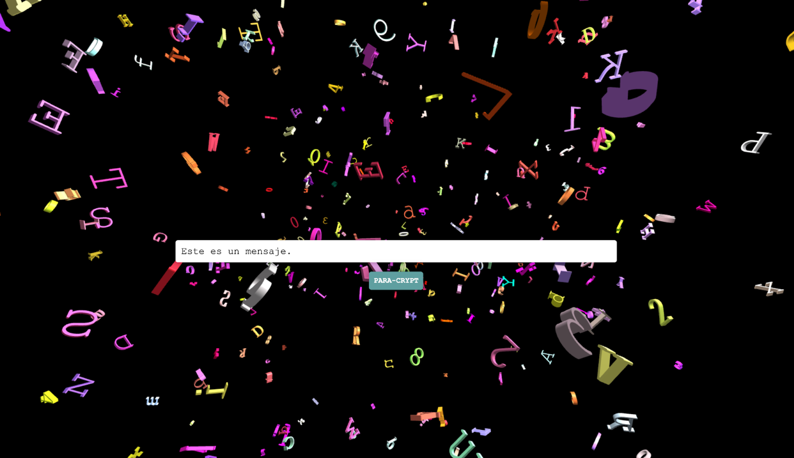
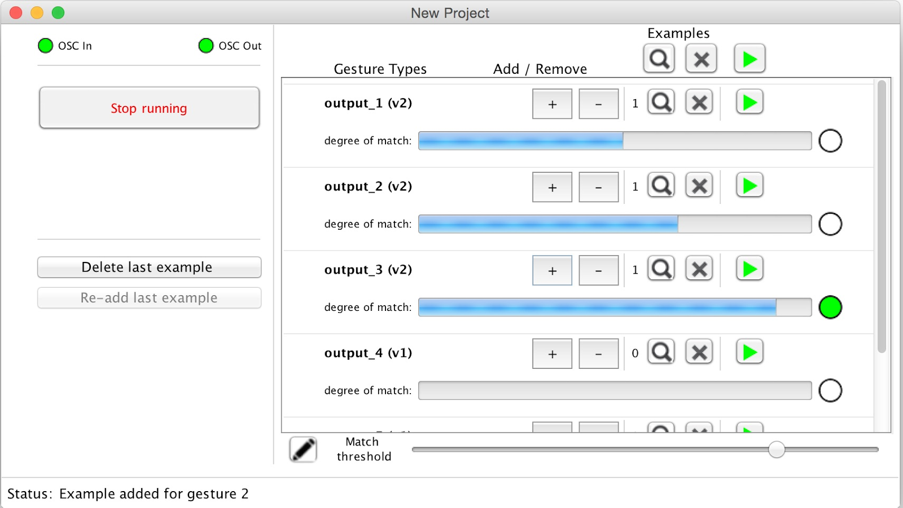
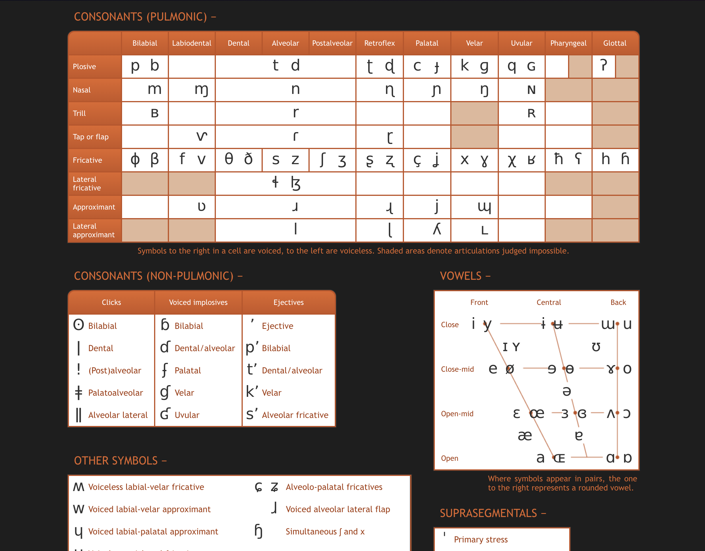

# Introducción

## Propósito y Motivación

El sonido en el habla comenzó a interesarme a partir de un viaje en el que recorrí varios países europeos. Escuchar a la gente a mi alrededor despertó una inquietud acerca de cómo sonaban los distintos idiomas. Grabando material y mediante una escucha reducida comencé a establecer ciertas relaciones entre lenguas que, en un plano geográfico y/o cultural, no tenían relación alguna. ¿Qué sucedería si se plantea un mapa donde las distancias entre territorios estén representadas acorde a la similitud de sus _fonemas_? Siendo fonemas una unidad mínima de sonido para formar palabras.

Resulta curioso cuando las personas pueden identificar los idiomas sin saber hablarlos; quizás escuchando música de algún lugar, TV o cualquier material donde se escuche gente hablando, algunas personas logran identificar correctamente qué idioma están escuchando. ¿Por qué sucede esto? **¿Qué características de una lengua sintetizan su identidad?** ¿Cuáles son los aspectos que los vuelven _familiares_?

No poder hablar un idioma hace que, al escucharlo, no comprendamos la idea concreta que se trata de comunicar. Si descartamos la gestualidad que entra por lo visual, podemos _asignarle_ determinado sentido a partir del tono, el volumen, el énfasis, pero esto se vuelve un ejercicio de adivinanza intuitiva, que quizás nunca alcance el verdadero sentido. Esto me despierta un particular interés. El habla que no hace sentido como un acercamiento abstracto al lenguaje; los sonidos espásticos que hacemos para comunicarnos. Así como existe la escritura asémica, por qué no pensar en _habla asémica_, como un balbuceo. Entre estas preguntas e inquietudes, más el uso de tecnologías de inteligencia artificial surge la idea de crear un _sintetizador de habla asémica_, es decir, habla que carezca de sentido, lo cual lo diferencia de un texto a habla (TTS) en el que el usuario escribe un texto y luego es reproducido por una voz sintetizada. Este software sería capaz de generar habla que remite a cierta lengua que el usuario pueda elegir, incluso la posibilidad de _mezclar_ varias, sin ingresar contenido semántico. La mezcla consistiría en la interpolación dentro de la red neuronal generadora buscando lo que hay dentro del _espacio latente_ luego de haber sido entrenada con grandes datasets de audio clasificado en cada lengua. De esta manera podríamos establecer la _forma_ conocida, o familiar, y la _forma_ desconocida, que viene de esta interpolación.

Quizás esta tecnología pueda dar al menos un acercamiento a conocer los aspectos formales sonoros que identifican a un lenguaje particular, y además descubrir qué hay, por ejemplo, _entre_ algunos idiomas en los que intuitivamente podemos hallar similitudes como fonemas coincidentes o aquellos que sean completamente ajenos entre sí. ¿Qué sucede entre lenguas? ¿Esos resultados nos serán familiares? ¿Por qué? ¿Podemos priorizar la sonoridad por sobre el sentido? ¿Qué otras preguntas pueden llegar a surgir a partir de escuchar estos nuevos sonidos?

El proyecto pretende investigar este aspecto y así generar espacios para resultados concretos como el software de habla propuesto anteriormente, recreación de voces como familiares y la propia, performances de _sono-lenguas,_ piezas sonoras, instalaciones, personajes virtuales que las hablen, entre otros. Esta exploración propone un recorrido donde sus ramas se retroalimentan con estos resultados para continuar profundizando, generando un mapa o mejor aún, una red de conocimiento.

Quiero interpelar al imaginario de quienes lo experimentan, buscando empatizar con ciertos sectores de nuestra memoria para evocar una sensación de familiaridad, acoplarse a una parte de nuestra experiencia que no alcanza a ser racionalizada. Ese lugar intermedio es de sumo interés para mi trabajo.

## Proceso Creativo

La operación recurrente que realizo en las piezas y obras que hice a lo largo de mi carrera es la de despojar de sentido -o al menos el sentido conocido o cotidiano- a la mirada que tenemos sobre el mundo, sus cosas, la existencia que nos atraviesa por los sentidos. Al liberar las cosas de su contenido semántico, se da lugar a re-generar el sentido, desde una perspectiva nueva.

A continuación, expongo una serie de obras/piezas que ejemplifican esta metáfora del sentido.

### No son señales

[Link al artículo](https://www.juanm.art/in/projects/nosonseniales) - [Link al video](https://vimeo.com/625016744)

  
  

Esta obra se expuso en el espacio común del Museo MAR de Mar del Plata, es decir, no se situó en sala sino en el hall principal, ocupando espacios de circulación donde la mirada es casual, no atenta a una mirada de espectador del arte que busca -quizás- cierto valor estético. Se trata de una serie de tres anamorfismos: distorsiones deliberadas de una imagen que requieren una perspectiva específica para revelar su forma verdadera. Dos de las piezas que conforman la obra incluso requieren que la mirada atraviese distintos planos de profundidad, como si el mundo que habitamos fuera bi-dimensional (2D) y las imágenes que observamos fueran planas.

### Parallax-Cryptography

[Link al artículo](https://www.juanm.art/in/projects/paracrypt) - [Link a la obra](https://juanmartin.github.io/)

Esta pieza de Net Art propone un acertijo de perspectivas que utiliza letras como símbolos arbitrarios de lenguaje. Mediante una interfaz de buscador bastante cotidiana y un algoritmo geométrico, quien utilice el sitio puede encriptar un mensaje perdido en una suerte de sopa de letras tridimensional que sólo puede desencriptar encontrando la perspectiva única donde la profundidad de campo visual deja de ser relevante. Se puede navegar y recorrer este universo de símbolos libremente hasta encontrar la perspectiva que revela el mensaje.

### Serie Alineaciones (fotografía)

  
  
  

Una serie de fotos no publicadas -aún- donde se alinean perspectivas en distintas profundidades. Se aprecian como imágenes 2D extraídas de nuestro mundo tridimensional. ¿Qué sucede si dejamos de entender la imagen? Si descartamos lo que hay allí en lo que vemos, sólo son colores y formas que nos propone la realidad.

### Patentes

Instagram: [@patentepatente](https://www.instagram.com/patentepatente)

  
  
  
  

Otra serie de fotografías de patentes (matrículas) de vehículos en la calle. A veces _aparecen_ textos que pueden formar las letras más los números si los convertimos a su semejante en letra, por ejemplo el 7 una T, el 3 una E, el 1 una I o l, el 8 una B, etc. Resulta relevante también el hecho de que _justo_ haya ubicado los ojos sobre ese texto callejero, como si fuera un _mensaje_ que nos toca ver.

### Silencio de Alerta - Instalación

  
  

Esta obra fue montada en el antiguo anexo de la UNTREF como parte de la muestra final del Taller de Creación Sonora de Nicolás Varchausky. Se trata de una instalación puramente sonora, que busca pasar desapercibida. No tiene componente visual, es sólo sonido que invade el espacio y de pronto se detiene. Busca simular esos _ruidos_ constantes que se vuelven parte del paisaje sonoro de la cotidianeidad, que sólo cuando cesan, uno se da cuenta que siempre estuvieron, dejando una sensación de alivio repentino.

### Corolario

A partir de este corpus de obras, el ejercicio siguiente que me propongo -como trabajo final de grado- es el de alguna forma intentar despojar el lenguaje de sentido. El lenguaje es el medio fundamental/principal a través del cual producimos sentido. El mundo de las ideas platónico no sería posible sino por el lenguaje. Si bien existen símbolos y otras formas de comunicar algún sentido, todo termina siendo explicado por el lenguaje en su medio visual o sonoro.

## Acerca de esta investigación

Considero este proceso una investigación artística guiada por intereses personales acerca del lenguaje y su sonoridad. El objetivo material fue el desarrollo de un software capaz de generar _habla asémica_, es decir, aquella que simula habla humana eliminando el contenido semántico y dejando sólo su sonoridad.

Así como noto que hay idiomas entre idiomas, observo la distancia entre las _matemágicas_ complejas y los resultados sonoros, las matrices y métodos de clases de librerías y los espectrogramas generados. ¿Dónde me encuentro? ¿Es acaso la intersección perfecta entre las ganas de hacer ruido y la manía del niñx que quiere desarmar y armar de nuevo un aparato a su manera? Aquí me encuentro como artista investigador en la intersección del arte y la ciencia, y de la búsqueda estética y la técnica.

A partir de este desarrollo como guía del proceso, se espera -y se celebra- la emergencia de resultados o salidas tanto materiales como teóricas. Mi interés está puesto en el proceso creativo que se comparte entre el aspecto estético y su requerimiento técnico. Este escrito es el relato del recorrido que fue dándose teniendo como objetivo dicho software, incluyendo las ideas y los desafíos que surgieron, los experimentos y sus pequeñas piezas, y por supuesto este mismo texto como parte de una obra en constante evolución y proceso que no concluye con el fin de esta narración, sino que es puntapié para su posterior investigación y desarrollo.

En este recorrido comenzaré mencionando referencias en distintas áreas de interés sobre el tema, algunos breves conceptos teóricos que ayudan a la comprensión, para luego continuar con los experimentos que realicé, su desarrollo e ideas que surgieron. Por último, contaré algunas entrevistas que obtuve de personas que consulté durante el proceso para finalizar con los conceptos más duros de la parte técnica del desarrollo. Incluye un apéndice con fragmentos de código, glosario de términos y otras interacciones interesantes humano-máquina.

## Estado de la cuestión

A continuación, daré a conocer algunas referencias que considero relevantes para llevar a cabo este experimento, parte del camino de la investigación, incluyendo aspectos técnicos -tanto tecnológicos como teóricos del habla y la lengua- que lo posibilitan, experiencias tangenciales al objeto de estudio, y algunas referencias dentro del campo del arte sonoro donde podría inscribirse este desarrollo.

Antes de las categorías, presento un ejemplo que va de manera muy concisa al meollo del asunto. Ari Smith (aka Xiaoman) es un políglota profesional y youtuber, aprende muchos idiomas muy rápido y viaja por el mundo sorprendiendo a la gente hablando la lengua nativa del lugar. Con tanto conocimiento real acerca de diferentes idiomas, me parece un excelente referente para hacer esta "performance de imitación".

<iframe width="100%" height="500" src="https://www.youtube.com/embed/QxrDNRhYFyI?si=-gL8SeyQj_i4EHIr" title="YouTube video player" frameborder="0" allow="accelerometer; autoplay; clipboard-write; encrypted-media; gyroscope; picture-in-picture; web-share" referrerpolicy="strict-origin-when-cross-origin" allowfullscreen></iframe>

No sólo el contenido del video muestra lo que busco realizar a través del software de manera generalizada, sino que los comentarios del video resaltan con claridad esta rama de ideas acerca de los lenguajes:

  
  
  
  

### Arte

")

**Éramos la humanidad** (Amaral, 2022) es un proyecto audiovisual de Mateo Amaral que utiliza distintos sistemas de inteligencia artificial y motores de videojuegos para imaginar un futuro posthumano. En este futuro, los Entes -seres híbridos entre inteligencia artificial y vida orgánica- habitan un extraño ciberespacio entre estructuras incompresibles y restos de la cultura humana.

La instalación consiste en la superposición de dos ecosistemas, uno virtual y otro vegetal. Mientras que los escenarios y personajes digitales aparecen proyectados en las paredes, en el suelo hay montículos de tierra donde crecen plantas y del techo cuelgan raíces, lianas y líquenes. En la intersección, la luz de la proyección se encuentra con los cuerpos vegetales produciendo dibujos flotantes. El ecosistema virtual es generado en tiempo real por un motor de videojuegos que se juega a sí mismo o una obra de teatro improvisada por criaturas fantasmales. El programa sintetiza entornos a partir de la combinación de distintos elementos y luego puebla esos entornos con personajes dotados de inteligencia artificial.

<iframe width="100%" height="500" src="https://www.youtube.com/embed/adLxW1D6sO4?si=iNMSzclQ3fiPS1qC" title="YouTube video player" frameborder="0" allow="accelerometer; autoplay; clipboard-write; encrypted-media; gyroscope; picture-in-picture; web-share" referrerpolicy="strict-origin-when-cross-origin" allowfullscreen></iframe>

Lo particular que me interesó de la obra de Mateo es que sus entes-personajes hablan un idioma desconocido, pero a la vez familiar. Este es el punto al que deseo llegar. En su caso fue gracias a entrenar con pocas _épocas_ sus modelos de generación de voz, de manera que nunca llegaron a _aprender el idioma_ del todo, sino que quedaron truncos, eternamente balbuceando en su universo cibernético. El problema aquí es que no se puede _tunear_ el idioma a asimilarse, sino que tomó muestras de audio aleatorias para su modelo, de manera que es virtualmente imposible rastrear su origen.

**Archivo P.A.I.S.** de Nicolás Varchausky es un archivo de artista que explora las tensiones entre sonido y sentido en la voz hablada, sus perspectivas diversas de enunciación y contextos de sentido. Está organizado en 4 colecciones: La Voz del Mercado, La Voz de las Instituciones, La Voz De Dios y La Voz del Arte. Similar a un dataset de grabaciones urbanas, pero diferenciándose en su estructura y presentación, este trabajo me resulta afín dado que trata sobre la voz en su modo más puro y primitivo, de su _musicalidad_ dadas sus características de entonación y enunciación, variación tímbrica, tono. Su búsqueda yace en la intermodulación entre sentido y sonido (Archivo P.A.I.S., 2000).

El trabajo de Nicolás despierta algunas preguntas: ¿Se podrá separar del todo el contenido semántico al generar nuevas voces sintéticas? ¿Qué pasa con la entonación-intención? ¿Será inevitable comprender algo aunque no haya palabras reales? ¿Comprenderán lo mismo distintas personas a partir de una misma frase ficticia, supuestamente despojada de sentido?

**Grannma MagNet** (Akten, 2018) es un proyecto de síntesis de audio profundo con redes neuronales. Su objetivo no es crear sonidos que sean indistinguibles de los datos de entrenamiento (es decir, capaces de pasar una "prueba de Turing de audio"), sino crear sonidos que sean de alguna manera reminiscentes de los datos de entrenamiento, pero también novedosos y no humanos, pero aún interesantes, y, lo más importante, permitir a un usuario humano manipular de manera expresiva y significativa la salida en tiempo real.

No sólo es interesante este proyecto por la generación de sonidos que hagan referencia a su entrada al sistema, sino por la acción de interpolar naturalmente entre sonidos con la ayuda de IA, lo cual es un recurso que aplica a mi investigación en la búsqueda de nuevos lenguajes que existan _en el medio_ de otros preexistentes.

**Dadabots** (Carr & Zukowski, 2018) es un proyecto de generación de música a través de herramientas de IA. Con modelos de aprendizaje automático, específicamente SampleRNN han logrado recrear estilos clásicos de _música humana_ como punk, hard rock, metal, hardcore, math rock, entre otros. Esto es debido a que ciertos géneros musicales poseen sonoridades bien distinguibles y relativamente fáciles de generalizar. Con tan solo alimentar los modelos con influencias del estilo, ciertos géneros son reproducibles de manera fiel. Fueron de los primeros en realizar este tipo de operaciones con tanta precisión, y además publican sus papers en investigación acerca del asunto. La relevancia de este proyecto es que es uno de los primeros antecedentes de generación de audio tan fiel a su fuente, cumpliendo su objetivo, publicando en el ámbito académico y compartiendo su código en su GitHub para poder re-crearlo.

**HOME & Elsewhere** de Rosaire Appel (HOME & Elsewhere, 2014) me resulta relevante para mencionar la escritura asémica, que es una forma de escritura que se caracteriza por su falta de contenido semántico o legibilidad convencional. El mismo recurso que trataré en este trabajo en la dimensión sonora. Esta se trata de una forma de expresión en la que los trazos, símbolos y gestos de la escritura se utilizan para crear una experiencia estética y emocional en lugar de transmitir un significado lingüístico claro. En palabras de Appel: _marcas no asignadas, abstractas que se utilizan como elementos lingüísticos_.

  
  

Por último, me gustaría hacer mención a una obra fundacional en el arte sonoro, que hasta he recreado en 2016 durante mi cursada de la materia Psicoacústica dictada por Eleonora Rapán. Se trata de **"I am sitting in a room"** del compositor experimental Alvin Lucier (1969). En esta pieza, Lucier explora la relación entre el sonido, el espacio y la tecnología de grabación. La relación con mi trabajo es que esta pieza realiza la operación opuesta a la planteada en mi experimento sonoro.

La obra comienza con una grabación de la voz de Lucier diciendo: "I am sitting in a room different from the one you are in now. I am recording the sound of my speaking voice...". Esta grabación inicial se reproduce y se vuelve a grabar en la habitación una y otra vez. Con cada repetición, la resonancia y las características acústicas de la habitación se realzan y amplifican, mientras que la voz original se va desvaneciendo y transformando en una textura sonora más abstracta. A medida que la pieza avanza, los aspectos más reconocibles de la voz se vuelven borrosos y se disuelven en el sonido del espacio mismo. Al contrario al objetivo sonoro de mi software, que será partir de audio totalmente entendible a otro que no lo es, pero hace referencia a aquel que fue, y además en este caso eliminamos la componente del espacio acústico.

### Software

El software es un componente clave de este desarrollo. A continuación menciono dos aplicaciones/herramientas referentes dentro del campo de las Artes Electrónicas que conozco y he utilizado. Para adentrarse en profundidad en materia de software y sobre todo de inteligencia artificial, más adelante en la sección de Conceptos Técnicos y Glosario se encuentran descripciones detalladas de las tecnologías y términos que aparecen a lo largo del trabajo.

**Wekinator** (Wekinator, n.d.) es un software creado por Rebecca Fiebrink en 2009 que permite a los usuarios entrenar modelos de aprendizaje automático en tiempo real para crear aplicaciones interactivas y sistemas de control personalizados. Su enfoque en la interactividad y la creatividad lo hace especialmente adecuado para procesos creativos en música, arte, diseño interactivo y performance, ofreciendo a los artistas y diseñadores nuevas formas de explorar la interacción humano-máquina.

Este software fue uno de los primeros encuentros que tuve con IA y vale la pena mencionarlo ya que en el campo de las artes electrónicas podría considerarse como una navaja suiza de la inteligencia artificial, dado que de manera muy intuitiva uno puede _mapear_ gestos desde alguna entrada como una cámara o sensor a datos fácilmente traducibles en audio, imagen o la interacción con actuadores físicos.

**AudioStellar** (Garber et al., 2020) es un software de exploración de _constelaciones_ conformadas por una gran cantidad de muestras de sonido. Puede utilizarse tanto como un visualizador para encontrar rápidamente los _samples_ que uno necesita para la realización de piezas sonoras, simplemente organización visual, o mejor aún, como herramienta performática gracias a sus intuitivos y creativos modos de recorrer estos espacios sonoros.

En principio debe generarse el mapa basado en una colección de muestras -preferentemente de corta duración- a través de alguno de los algoritmos de clasificación disponibles. Una vez terminado el proceso, el software muestra cada sonido como un punto en un mapa bidimensional. La idea es que estén organizados por similitud, es decir, por características tímbricas que los ubican en un área cercana. Por ejemplo, cortes de voces -vocal chops- estarían en un sector lejos de otros como golpes de batería.

Más adelante se describe cómo este software se utiliza para generar algunos outputs de mi trabajo. La idea de organizar fonemas, sin importar el lenguaje, en un mapa resulta en una clara forma de visibilizar cercanías o lejanías entre sonidos de distintos idiomas. ¿Qué escucharemos al recorrerlos en las novedosas formas que propone este software? ¿Podríamos pensar en nuevas sonoridades lingüísticas a partir de organizar recorridos a través de fonemas provenientes de diferentes idiomas?

### Música

En el ámbito de la música popular, las voces sintetizadas han desempeñado un papel importante en la creación de estilos musicales únicos y reconocibles. Estas voces sintéticas, generadas mediante el uso de hardware y software de síntesis de voz, han sido utilizadas por diversos artistas para agregar un elemento distintivo a sus producciones musicales.

Un ejemplo destacado de la incorporación de voces sintetizadas en la música popular es el grupo alemán Kraftwerk. Pioneros en el género de la música electrónica, utilizaron voces robotizadas y sintetizadas en muchas de sus canciones. Su álbum icónico "Autobahn" (1974) presenta voces sintetizadas que aportan a su estética futurista y mecánica, complementando su estilo musical innovador.

Otro ejemplo relevante es el dúo francés Daft Punk. Con su enfoque único en la música electrónica y el uso de voces robóticas, Daft Punk ha logrado crear un sonido único y reconocible en algunos de sus éxitos como "Around the World" y "Harder, Better, Faster, Stronger".

La utilización de voces sintetizadas en la música popular permite a los artistas explorar nuevas formas de expresión y crear atmósferas únicas en sus composiciones. Al eliminar las limitaciones vocales humanas tradicionales, las voces sintéticas ofrecen un amplio abanico de posibilidades creativas y permiten a los músicos experimentar con diferentes estilos y géneros musicales. ¿Cómo podríamos insertar una nueva herramienta de generación de habla sintética, que no apele al significado si no a una pura propiedad morfológica del lenguaje en aporte a su estética?

### Videojuegos

**Los Sims** lanzado en el año 2000 fue desarrollado por Maxis Studios y publicado por Electronic Arts. En este juego de simulación de vida, los personajes se expresan y conversan entre sí utilizando un idioma que no existe, con reminiscencias a una combinación de varios que sí existen.

En los videojuegos y otras ficciones encontramos repetidas iteraciones de esta operación, pero considero este caso bien claro y lo suficientemente insertado en el imaginario colectivo para darle especial relevancia. Que sea parte de nuestro imaginario, por ejemplo, en las generaciones que lo jugamos, es importante para el reconocimiento de este tipo de sonoridades. Lo mismo ocurre con los idiomas del mundo.

<iframe width="100%" height="500" src="https://www.youtube.com/embed/c379Giun-Co?si=1ClwlQdr1iBX30pV" title="YouTube video player" frameborder="0" allow="accelerometer; autoplay; clipboard-write; encrypted-media; gyroscope; picture-in-picture; web-share" referrerpolicy="strict-origin-when-cross-origin" allowfullscreen></iframe>

Cuanto más abstracta sea una representación, más se puede insertar en eso la propia subjetividad. Cuanto más detalle se agregue, menos lugar queda a la intuición y la imaginación. **¿Cuál es el punto de equilibrio entre abstracción y especificidad que necesitamos para reconocer un idioma y que al mismo tiempo permita que nuestra creatividad complete los huecos semánticos?**

## Lingüística

Dado que este trabajo se ancla en la generación de habla sintética, es importante comprender algunos conceptos básicos de la lingüística, la fonética y la fonología. Estas disciplinas se ocupan del estudio de los sonidos del habla, su producción y organización en los idiomas humanos, y cómo estos sonidos se combinan para formar palabras y oraciones con significado.

### El sonido del habla

Los sonidos de las lenguas son el resultado de la combinación de diferentes rasgos fonéticos, como el modo, el punto y la fuerza de articulación, la duración, la amplitud y la frecuencia, la coarticulación, la asimilación, la armonía vocálica, y los aspectos ilocutivos (intenciones).

El estudio de la fonética y la fonología no solo ayuda a entender cómo los sonidos se producen en el habla humana, sino también cómo los idiomas se diferencian entre sí. Cada idioma tiene su propio conjunto de sonidos (algunos únicos y distintivos, otros que comparten) y se organizan de determinada manera. Estas disciplinas dentro de la lingüística nos permiten identificar y comparar estos sonidos (Ladefoged &amp; Maddieson, 1996).

La fonética se enfoca en la producción de sonidos individuales, aislados. Existe la fonética acústica: aquella que estudia las ondas sonoras, su componente sonoro físico; y la fonética articulatoria: que se centra en la forma en la que el humano produce el sonido con su cuerpo (músculos, flujo de aire). Por ejemplo, la pronunciación de la "r" en español es diferente a la pronunciación de la "r" en inglés, incluso difiere dentro del mismo inglés. Pensémoslo como el _banco de sonidos_ en el habla. Además, algunos idiomas tienen sonidos que no existen en otros. Por ejemplo, el idioma Xhosa, uno de los 11 idiomas hablados en Sudáfrica, tiene tres clics distintos que no existen en otros idiomas.

<iframe width="100%" height="500" src="https://www.youtube.com/embed/W6WO5XabD-s?si=3xarbdUDQIVSaG9A" title="YouTube video player" frameborder="0" allow="accelerometer; autoplay; clipboard-write; encrypted-media; gyroscope; picture-in-picture; web-share" referrerpolicy="strict-origin-when-cross-origin" allowfullscreen></iframe>

La fonología se enfoca en cómo los sonidos se combinan para formar palabras y oraciones y así identificar patrones distintivos en diferentes idiomas para entender cómo se diferencian y se relacionan entre sí. Estudia la combinación de fonemas en la estructura y la sintaxis de un idioma -o cualquier idioma- para generar determinado significado. Básicamente la fonología le da contenido semántico a la fonética, que la usa como medio para estructurar el habla humana.

### Gramática Generativa

La Gramática Generativa, desarrollada por Noam Chomsky en la década de 1950, es una teoría lingüística que busca explicar la estructura de los lenguajes humanos basándose en la idea de que la capacidad para el lenguaje es innata y se rige por reglas universales. Esta teoría incluye componentes como el fonológico, que se ocupa de los sonidos del lenguaje; el léxico, que aborda el significado de las palabras; y el sintáctico, que se centra en la formación de las oraciones. Chomsky sostiene que existen reglas subyacentes comunes a todos los idiomas, representadas a través de una notación formal conocida como "gramática generativa-transformacional" (Chomsky, 1957).

Una característica clave de la Gramática Generativa es la distinción entre "competencia lingüística" y "actuación lingüística". La competencia lingüística es el conocimiento innato e inconsciente de las reglas gramaticales que posee cada hablante nativo, mientras que la actuación lingüística es el uso práctico y observable del lenguaje en la comunicación diaria. Además, la gramática generativa-transformacional describe las transformaciones que ocurren en la generación y comprensión de las oraciones, permitiendo a los hablantes modificar estructuras oracionales para expresar diferentes significados y relaciones gramaticales.

## Sinsentido

Durante mi proceso creativo generalmente elijo militar la experiencia de lo sensible por sí misma. Es natural encontrarme con la discusión acerca del sentido de lo que hago. Es como si la experiencia estético-sensible no alcanzara y fuera necesario algo más que la obra para que haya contenido. La teoría estética tiene infinitos autores que abordaron este tema: Aristóteles, Kant, Benjamin, Adorno, Sontag, Groys, Derrida, Wittgenstein, etc. A mi, en particular, me interesó pensar en clave de dos líneas: el giro lingüístico y la lógica del sentido de Deleuze.

Desde muy joven siento que el lenguaje a mí no me alcanza, ni me parece el medio adecuado para transmitir mi experiencia de lo sensible. Siento que es una tarea muy ambiciosa y una gran responsabilidad para asignarle al lenguaje. En nuestra sociedad hay mucha exigencia para hacerlo así, hacer esta tesis fue para mi de particular dificultad por eso, y creo que el giro lingüístico influyó mucho en que así sea. El giro lingüístico enfatiza el lenguaje como el principal medio a través del cual entendemos y construimos la realidad. Sin embargo, este enfoque tiene sus limitaciones, especialmente cuando se trata de transmitir experiencias propias de la sensación que van más allá de las palabras.

Además de comprender las limitaciones del lenguaje, me parece crucial reconocer la relevancia de otros tipos de inteligencias no racionales, más cercanas a los mecanismos de un animal, que destacan la conexión directa entre la sensibilidad y la acción sin intermediarios racionales. Me interesa explorar otro paradigma donde la experiencia sensible se comunica y se vive de manera inmediata y visceral. Este enfoque subraya la importancia de explorar cómo nuestras percepciones y acciones están intrínsecamente conectadas sin la necesidad de una mediación lingüística.

Para entender cómo las experiencias sensibles pueden ser transmitidas a través de medios no lingüísticos es interesante el aporte de Gilles Deleuze (1994). El propone que el sinsentido no es una ausencia de significado, sino una dimensión activa que coexiste con el sentido. El autor plantea que el sinsentido permite la creación de nuevos significados y abre espacios para formas de expresión que no pueden ser capturadas por el lenguaje verbal. En una línea similar, Foucault (1982) analiza cómo el lenguaje y la realidad se disocian, y sugiere que hay aspectos de la experiencia humana que no pueden ser completamente capturados por las palabras.

El Giro Lingüístico ha sido fundamental para entender cómo el lenguaje estructura nuestra percepción de la realidad, no obstante, la contracara de esto es que la racionalidad impuesta por el giro lingüístico crea una distancia entre el ser humano y su experiencia corporal y sensorial. Deleuze, al criticar esta totalización, sugiere que es necesario trascender el lenguaje verbal y explorar otras formas de expresión que involucren directamente al cuerpo y los sentidos.

A lo largo de este trabajo tomo el sinsentido como un recurso estético que utilizo en distintos niveles de mi investigación. Me refiero al sentido propio de esta investigación, de mi carrera, del constante accionar en cada paso de cada experimento. Entrando a la materialidad: el sentido sonoro por sí mismo, el nuevo sentido que genera el sinsentido, un relato que no tiene sentido pero puede ser interpretado y genera imágenes que tienen sentido en un mundo cuyas reglas del sentido son otras.

El prefijo negativo de _sin-sentido_ propone una falta, pero como se plantea en “The Sound of Nonsense” también es _meta-sentido_ y es que esto refiere a una nueva estrategia, una decisión arbitraria, diferente (Elliott & Bull, 2017). No es lo opuesto al sentido, es otra cosa. Esto va en línea con el trabajo de escritores del sinsentido, como Lewis Carroll, conocido por su famosa obra “Alicia en el país de las maravillas”. Me atrevo a mencionar al movimiento del _Realismo Mágico_, que conocí gracias a Gabriel García Márquez, en donde las reglas del juego parecen cambiar por completo a nuestro universo pero allí son parte de la cotidianeidad. Me gustaría decir que es nuestra versión latinoamericana del sinsentido.

Richard Elliot (2017) no logra una definición concreta del sinsentido por lo que establece cinco pautas de a que se refiere con sinsentido en su texto. Me quedo con dos de ellas, y el entramado entre todas:

> Destaco las que me interesan:
>
> - **Aquello que introduce una lógica alterada incluso cuando se utiliza un lenguaje _norma_. Sería el reino de [Lewis] Carroll y sus seguidores o de la comedia Goonesca.**
> - Lo que se mantiene dentro de un régimen sintáctico «normal» pero introduce fallos y otras estrategias disruptivas y juega con la lógica de la semántica. Los escritores y músicos modernistas y posmodernistas estarían entre los ejemplos de este tipo.
> - **Lo que surge de alterar la sintaxis para crear magia, confusión o verdad. Incluiría recortes, permutaciones y otras estrategias que juegan con la lógica de la sintaxis.**
> - Lo que roza o se solapa con lo absurdo. Esto incluiría el drama Beckettiano y la canción Dylanesca.
> - Lo que utiliza códigos o términos que sólo entienden los especialistas o los iniciados. Para los no especialistas o ajenos al tema, sólo se trata de «tonterías», lo que comúnmente se conoce como jerga. Esto incluye el lenguaje de moda, como el jazz jive, la jerga del hip-hop, los términos subculturales, ciertos discursos académicos y el Shipping Forecast de la BBC.
>
> Entre ellos se encuentra el momento del sinsentido, ese espacio de desconcierto entre dos o más modos de significado en el que la búsqueda de sentido se convierte en un intercambio de códigos.
>

Quizás se vea borroso el borde entre el sinsentido y la fantasía, pero la fantasía adhiere a un sistema de reglas y lógicas que se respetan a lo largo de su desarrollo. El sinsentido, por otro lado, desafía constantemente cualquier atisbo de regla que se establezca. Está más cerca de un mecanismo que permite el lenguaje: poder decir cualquier cosa, armar estructuras de palabras que no suelen ir juntas, casi como si la materialidad de un juego de encastrar piezas sean palabras, o incluso mejor: letras.

> 
Es aleifuv una emuuef forma dkljelkeaji orden ojfodj palabras qe mve letras unoe j d ap.

Y no pasa nada. Como si fuera simplemente _otra forma_ de armar una oración, sólo porque se puede.

Las limitaciones del lenguaje para capturar la totalidad de la experiencia humana nos llevan a la necesidad de recurrir a otras formas de sensibilidad. Los sonidos pueden crear "lenguajes" que, aunque carezcan de un significado semántico directo, evocan sensaciones y experiencias profundas. Esta capacidad de los sonidos para transmitir lo inefable resalta la importancia de explorar medios no verbales para comunicar la experiencia de lo sensible.
